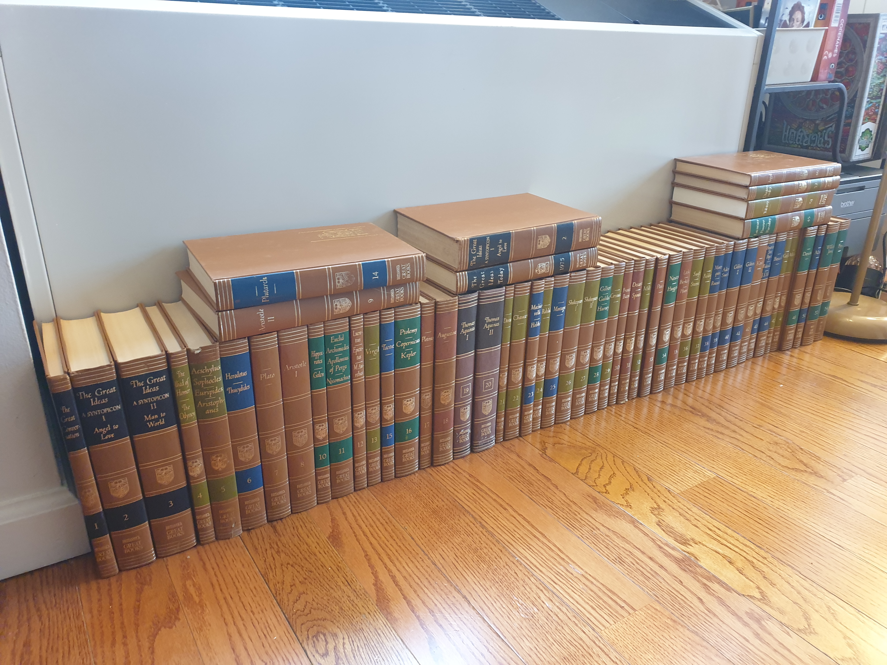

import foldableParagraph from '~/components/foldableParagraph.vue'

I'm starting a 10 Year Reading Plan proposed in the [1st Volume (The Great Conversation)](/the-great-conversation/) of the "Great Books of the Western World" series.

This plan is great because it is designed to help increase your chances of consuming and understanding classic works that might feel difficult at first (Aristotle, Thomas Acquinas, Hegel, and others).

> [Texts] get more difficult from year to year in two ways. The selections get longer, and they deal with more difficult subject matters.

See the reading plan with links [below](#reading-list).

Right now I'm reading in isolation, but would love to find a group of people who would join me on this journey. I think the best thing one can do to improve understanding is to discuss it with others. If you would like to join me, email me (me at domain of this site).

This is an ongoing project / post, so feel free to follow along and join me at whatever stage of the journey you are at. Would love to talk to similar minded people.

## Great Books

About 4 year ago I was reading Mortimer Adler's book "[How to Read a Book](https://www.goodreads.com/book/show/567610.How_to_Read_a_Book?from_search=true&from_srp=true&qid=SEJLp8bb3B&rank=1)", since I wanted to greatly improve how I read. I read a good chunk of the book, but found it a little to dry, so I "dropped" it. Reading it, was not a waste of time, as I learnt quite a bit of things about Analytical reading and reading in general. However, one of the biggest gifts this book has given me is [a list of Recommended Books](https://bathtubbulletin.com/mortimer-adlers-reading-list/) that would go well with the type of reading that Mortimer talked about in the book.

This list intrigued me. I thought that it would be very cool to finish such a list, as if some world secret would open up to me. Obviously I don't think that, but I still do think that books from that list could change someone's life for sure.

At the time I thought that most of the books were a little difficult for me, to which Mortimer agreed:

> All of these books are over most people’s heads—sufficiently so, at any rate, to force most readers to stretch their minds to understand and appreciate them.

So I kind of the left the list for some time.

Fast forward 3 years, after reading a lot of (**newer**) books, and not making many notes, I decided to change my approach. I started to read more thoughtfully. I started to make more highlights, more annotation, more side notes, using various mediums (Kindle, Book Stickies, Journal, etc.). I also synced all these mediumd into [Readwise](https://readwise.io/) and slowly loading all the notes to my [Zettelkasten](/how-to-take-smart-notes/) using [Obsidian](https://obsidian.md/).

I started learning and remebering more from the books I read. Then earlier this year I somehow ran into the book series called the "[Great Books of the Western World](https://en.wikipedia.org/wiki/Great_Books_of_the_Western_World)". I started looking at the contents and realised it is very similar to the one that Mortimer Adler compiled. To my surprise he compiled that one too, with a team from University of Chicago.

I thought I'm ready to start reading the old books, the Great Books. I mostly read books on Kindle, but for this, I really wanted to read physical books from the actualy Encyclopædia Britannica publishing. I found the full set printed in 1971 on Ebay for $80, plus $70 for delivery.

When I received them, I was in shock. Some of them felt like they were never opened. That is to say condition of most of them was superb. Now I just have to start reading.

## Reading List

Where possible I'll be adding links to onnline resources where you can read them for free. When such resources are available it is highly likely that I'll be leaving thoughts and comments using the [Hypothes.is](https://web.hypothes.is/) Add-on. I encourage you to install it and join the conversation, like the authors of these fantastic books did.

### Year 1

<foldableParagraph>

  1. Plato
    - ~~Apology~~ ([Text](http://classics.mit.edu/Plato/apology.html), [My Notes](/apology-plato/))
    - ~~Crito~~ ([Text](http://classics.mit.edu/Plato/crito.html))
  2. Aristophanes
    - ~~Clouds~~ ([Text](http://classics.mit.edu/Aristophanes/clouds.html))
    - ~~Lysistrata~~ ([Text](https://www.gutenberg.org/files/7700/7700-h/7700-h.htm))
  3. Plato: ~~Republic [Book I-II]~~ ([Book I Text](http://classics.mit.edu/Plato/republic.2.i.html), [Book II Text](http://classics.mit.edu/Plato/republic.3.ii.html))
  4. Aristotle: ~~Ethics [Book I]~~ ([Text](http://classics.mit.edu/Aristotle/nicomachaen.1.i.html))
  5. Aristotle: ~~Politics [Book I]~~ ([Text](http://classics.mit.edu/Aristotle/politics.1.one.html))
  6. Plutarch: The Lives of the Noble Grecians and Romans
    - Lycurgus ([Text](http://classics.mit.edu/Plutarch/lycurgus.html))
    - Numa Pompilius ([Text](http://classics.mit.edu/Plutarch/numa_pom.html))
    - Lycurgus and Numa Compared ([Text](http://classics.mit.edu/Plutarch/n_l_comp.html))
    - Alexander ([Text](http://classics.mit.edu/Plutarch/alexandr.html))
    - Caesar ([Text](http://classics.mit.edu/Plutarch/caesar.html))
  7. New Testament
    - The Gospel According to Saint Matthew
    - The Acts of the Apostles
  8.  St. Augustine: Confessions [Book I-VIII]
  9.  Machiavelli: The Prince
  10. Rabelais: Gargantua and Pantagruel [Book I-II]
  11. Montaigne: Essays
      - Of Custom, and That We Should Not Easily Change a Law Received
      - Of Pedantry
      - Of the Education of Children
      - That It Is Folly to Measure Truth and Error by Our Own Capacity
      - Of Cannibals
      - That the Relish of Good and Evil Depends in a Great Measure upon the Opinion We Have of Them
      - Upon Some Verses of Virgil
  12. Shakespeare: Hamlet
  13. Locke: Concerning Civil Government [Second Essay]
  14. Rousseau: The Social Contract [Book I-II]
  15. Gibbon: The Decline and Fall of the Roman Empire [Ch. 15-16]
  16. The Declaration of Independence
  17. The Constitution of the United States
  18. The Federalist [Numbers 1-10, 15, 31, 47, 51, 68-71]
  19. Smith: The Wealth of Nations [Introduction—Book I, Ch. 9]
  20. Marx—Engels: Manifesto of the Communist Party

</foldableParagraph>

### Year 2

<foldableParagraph>

  1. Homer: The Iliad
  2. Aeschylus: Agamemnon, Choephoroe, Eumenides
  3. Sophocles: Oedipus the King, Antigone
  4. Herodotus: The History [Book I-II]
  5. Plato: Meno
  6. Aristotle: Poetics
  7. Aristotle: Ethics
     - Book II
     - Book III, Ch. 5-12
     - Book VI, Ch. 8-13
  9. Nicomachus: Introduction to Arithmetic
  10. Lucretius: On the Nature of Things [Book I-IV]
  11. Marcus Aurelius: Meditations
  12. Hobbes: Leviathan [Part I]
  13. Milton: Areopagitica
  14. Pascal: Pensées [Numbers 72, 82-83, 100, 128, 131, 139, 142-143, 171, 194-
      195, 219, 229, 233-234, 242, 273, 277, 282, 289, 298, 303, 320, 323, 325, 330-331,374, 385, 392, 395-397, 409, 412-413, 416, 418, 425, 430, 434-435, 463, 491, 525-531, 538, 543, 547, 553, 556, 564, 571, 586, 598, 607-610, 613, 619-620, 631, 640,644, 673, 675, 684, 692-693, 737, 760, 768, 792-793]
  15. Pascal: Treatise on the Arithmetical Triangle
  16. Swift: Gulliver’s Travels
  17. Rousseau: A Discourse on the Origin of Inequality
  18. Kant: Fundamental Principles of the Metaphysic of Morals
  19. Mill: On Liberty

</foldableParagraph>

### Year 3

<foldableParagraph>

  1. Aeschylus: Prometheus Bound
  2. Herodotus: The History [Book VII-IX]
  3. Thucydides: The History of the Peloponnesian War [Book I-II, V]
  4. Plato: Statesman
  5. Aristotle: On Interpretation [Ch. 1-10]
  6. Aristotle: Politics [Book III-V]
  7. Euclid: Elements [Book I]
  8. Tacitus: The Annals
  9. St. Thomas Aquinas: Summa Theologica [Part I-II, QQ 90-97]
  10. Chaucer: Troilus and Cressida
  11. Shakespeare: Macbeth
  12. Milton: Paradise Lost
  13. Locke: An Essay Concerning Human Understanding [Book III, Ch. 1-3, 9-11]
  14. Kant: Science of Right
  15. Mill: Representative Government [Ch. 1-6]
  16. Lavoisier: Elements of Chemistry [Part I]
  17. Dostoevsky: The Brothers Karamazov [Part I-II]
  18. Freud: The Origin and Development of Psychoanalysis

</foldableParagraph>

### Year 4

<foldableParagraph>

  1. Euripides:
     - Medea
     - Hippolytus
     - Trojan Women
     - The Bacchantes
  3. Plato: Republic [Book VI-VII]
  4. Plato: Theaetetus
  5. Aristotle: Physics [Book IV, Ch. 1-5, 10-14]
  6. Aristotle: Metaphysics [Book I, Ch. 1-2; Book IV; Book VI, Ch. 1; Book XI, Ch. 1-4]
  7. St. Augustine: Confessions [Book IX-XIII]
  8. St. Thomas Aquinas: Summa Theologica [Part I, QQ 16-17, 84-88]
  9. Montaigne: Apology for Raymond de Sebonde
  10. Galileo: Two New Sciences [Third Day, through Scholium of Theorem II]
  11. Bacon: Novum Organum [Preface, Book I]
  12. Descartes: Discourse on the Method
  13. Newton: Mathematical Principles of Natural Philosophy [Prefaces, Definitions, Axioms, General Scholium]
  14. Locke: An Essay Concerning Human Understanding [Book II]
  15. Hume: An Enquiry Concerning Human Understanding
  16. Kant: Critique of Pure Reason [Prefaces, Introduction, Transcendental, Aesthetic]
  17. Melville: Moby Dick
  18. Dostoevsky: The Brothers Karamazov [Part III-IV]
  19. James: Principles of Psychology [Ch. XV, XX]

</foldableParagraph>

### Year 5

<foldableParagraph>

  1. Plato: Phaedo
  2. Aristotle: Categories
  3. Aristotle: On the Soul [Book II, Ch. 1-3; Book III]
  4. Hippocrates:
      - The Oath;
      - On Ancient Medicine;
      - On Airs, Waters, and Places;
      - The Book of Prognostics;
      - Of the Epidemics;
      - The Law;
      - On the Sacred Disease
  6. Galen: On the Natural Faculties
  7. Virgil: The Aeneid
  8. Ptolemy: The Almagest [Book I, Ch. 1-8];
  9. Copernicus: Revolutions of the Heavenly Spheres [Introduction—Book I, Ch. 11];
  10. Kepler: Epitome of Copernican Astronomy [Book IV, Part II, Ch. 1-2]
  11. Plotinus: Sixth Ennead
  12. St. Thomas Aquinas: Summa Theologica [Part I, QQ 75-76, 78-79]
  13. Dante: The Divine Comedy [Hell]
  14. Harvey: The Motion of the Heart and Blood
  15. Cervantes: Don Quixote [Part I]
  16. Spinoza: Ethics [Part II]
  17. Berkeley: The Principles of Human Knowledge
  18. Kant: Critique of Pure Reason [Transcendental Analytic]
  19. Darwin: The Origin of Species [Introduction—Ch. 6, Ch. 15]
  20. Tolstoy: War and Peace [Book I-VIII]
  21. James: Principles of Psychology [Ch. XXVIII]

</foldableParagraph>

### Year 6

<foldableParagraph>

  1.  Old Testament [Genesis, Exodus, Deuteronomy]
  2.  Homer: The Odyssey
  3.  Plato: Laws [Book X]
  4.  Aristotle: Metaphysics [Book XII]
  5.  Tacitus: The Histories
  6.  Plotinus: Fifth Ennead
  7.  St. Augustine: The City of God [Book XV-XVIII]
  8.  St. Thomas Aquinas: Summa Theologica [Part I, QQ 1-13]
  9.  Dante: The Divine Comedy [Purgatory]
  10. Shakespeare: Comedy of Errors, The Taming of the Shrew, As You Like It, Twelfth Night
  11. Spinoza: Ethics [Part I]
  12. Milton: Samson Agonistes
  13. Pascal: The Provincial Letters
  14. Locke: An Essay Concerning Human Understanding [Book IV]
  15. Gibbon: The Decline and Fall of the Roman Empire [Ch. 1-5, General Observations on the Fall of the Roman Empire in the West]
  16. Kant: Critique of Pure Reason [Transcendental Dialectic]
  17. Hegel: Philosophy of History [Introduction]
  18. Tolstoy: War and Peace [Book IX-XV, Epilogues]

</foldableParagraph>

### Year 7

<foldableParagraph>

  1. Old Testament [Job, Isaiah, Amos]
  2. Plato: Symposium
  3. Plato: Philebus
  4. Aristotle: Ethics [Book VIII-X]
  5. Archimedes
      - Measurement of a Circle
      - The Equilibrium of Planes [Book I]
      - The Sand-Reckoner
      - On Floating Bodies [Book I]
  7. Epictetus: Discourses
  8. Plotinus: First Ennead
  9. St. Thomas Aquinas: Summa Theologica [Part I-II, QQ 1-5]
  10. Dante: The Divine Comedy [Paradise]
  11. Rabelais: Gargantual and Pantagruel [Book III-IV]
  12. Shakespeare: Julius Caesar, Antony and Cleopatra, Coriolanus
  13. Galileo: Two New Sciences [First Day]
  14. Spinoza: Ethics [Part IV-V]
  15. Newton
       - Mathematical Principles of Natural Philosophy [Book III, Rules]
       - Optics [Book I, Part I; Book III, Queries]
  16. Huygens: Treatise on Light
  17. Kant: Critique of Practical Reason
  18. Kant: Critique of Judgment [Critique of Aesthetic Judgment]
  19. Mill: Utilitarianism

</foldableParagraph>

### Year 8

<foldableParagraph>

  1. Aristophanes: Thesmophoriazusae, Ecclesiazusae, Plutus
  2. Plato: Gorgias
  3. Aristotle: Ethics [Book V]
  4. Aristotle: Rhetoric
    - Book I, Ch. 1—Book II, Ch. 1;
    - Book II, Ch. 20—Book III, Ch. 1;
    - Book III, Ch. 13-19
  6. St. Augustine: On Christian Doctrine
  7. Hobbes: Leviathan [Part II]
  8. Shakespeare: Othello, King Lear
  9. Bacon: Advancement of Learning [Book I, Ch. 1—Book II, Ch. 11]
  10. Descartes: Meditations on the First Philosophy
  11. Spinoza: Ethics [Part III]
  12. Locke: A Letter Concerning Toleration
  13. STERNE: Tristam Shandy
  14. Rousseau: A Discourse on Political Economy
  15. Adam Smith: The Wealth of Nations [Book II]
  16. Boswell: The Life of Samuel Johnson
  17. Marx: Capital [Prefaces, Part I-II]
  18. Goethe: Faust [Part I]
  19. James: Principles of Psychology [Ch. VIII-X]

</foldableParagraph>

### Year 9

<foldableParagraph>

  1. Plato: The Sophist
  2. Thucydides: The History of the Peloponnesian War [Book VII-VIII]
  3. Aristotle: Politics [Book VII-VIII]
  4. Apollonius: On Conic Sections [Book I, Prop. 1-15; Book III, Prop. 42-55]
  5. New Testament
    - The Gospel According to St. John
    - The Epistle of Paul the Apostle to the Romans
    - The First Epistle of Paul the Apostle to the Corinthians
  7. St. Augustine: The City of God [Book V, XIX]
  8. St. Thomas Aquinas: Summa Theologica [Part II-II, QQ 1-7]
  9. Gilbert: On the Loadstone
  10. Descartes: Rules for the Direction of the Mind
  11. Descartes: Geometry
  12. Pascal: The Great Experiment Concerning the Equilibrium of Fluids, On Geometrical Demonstration
  13. Fielding: Tom Jones (Vol.. 37)
  14. Montesquieu: The Spirit of Laws [Book I-V, VIII, XI-XII]
  15. Fourier: Analytical Theory of Heat [Preliminary Discourse, Ch. 1-2]
  16. Faraday: Experimental Researches in Electricity [Series I-II], A Speculation Touching Electric Conduction and the Nature of Matter
  17. Hegel: Philosophy of Right [Part III]
  18. Marx: Capital [Part III-IV]
  19. Freud: Civilization and Its Discontents

</foldableParagraph>

### Year 10

<foldableParagraph>

  1. Sophocles: Ajax, Electra
  2. Plato: Timaeus
  3. Aristotle:
      - On the Parts of Animals [Book I, Ch. 1—Book II, Ch. 1]
      - On theGeneration of Animals [Book I, Ch. 1, 17-18, 20-23]
  5. Lucretius: On the Nature of Things [Book V-VI]
  6. Virgil: The Eclogues, The Georgics
  7. St. Thomas Aquinas: Summa Theologica [Part I, QQ 65-74]
  8. St. Thomas Aquinas: Summa Theologica [Part I, QQ 90-102]
  9. Chaucer: Canterbury Tales
     - Prologue
     - Knight’s Tale
     - Miller’s Prologue and
     - Tale
     - Reeve’s Prologue and Tale
     - Wife of Bath’s Prologue and Tale
     - Friar’s
     - Prologue and Tale
     - Summoner’s Prologue and Tale
     - Pardoner’s Prologue and Tale]
  11. Shakespeare:
      - The Tragedy of King Richard II
      - The First Part of King Henry IV
      - The Second Part of King Henry IV
      - The Life of King Henry V
  13. Harvey: On the Generation of Animals [Introduction—Exercise 62]
  14. Cervantes: Don Quixote [Part II]
  15. Kant: Critique of Judgement [Critique of Teleological Judgement]
  16. Boswell: The Life of Samuel Johnson
  17. Goethe: Faust [Part II]
  18. Darwin: The Descent of Man [Part I; Part III, Ch. 21]
  19. Marx: Capital [Part VII-VIII]
  20. James: Principles of Psychology [Ch. I, V-VII]
  21. Freud: A General Introduction to Psycho-analysis

</foldableParagraph>