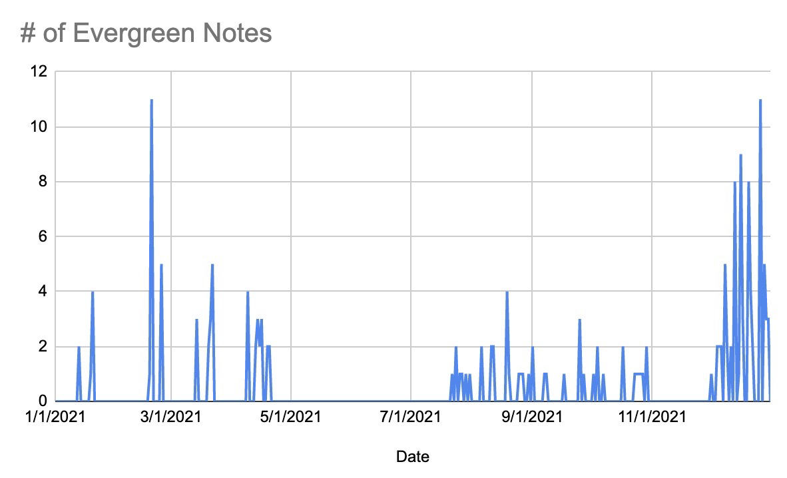
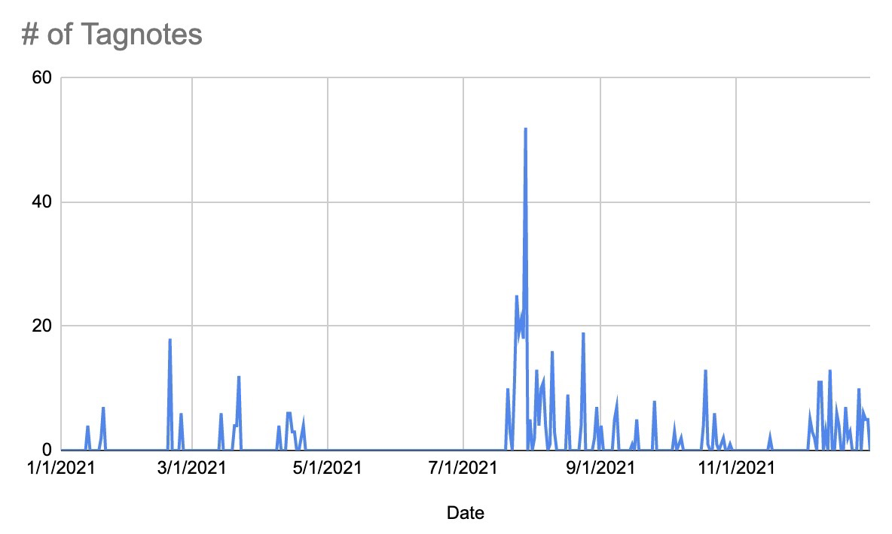
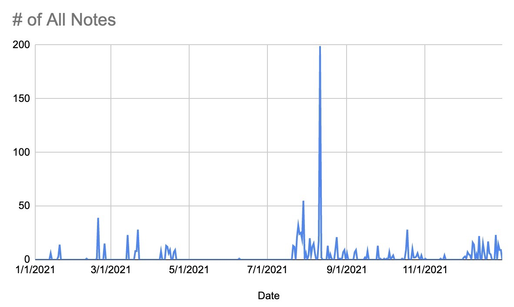
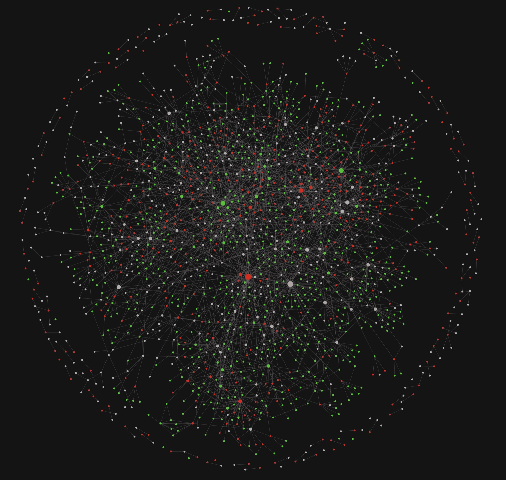
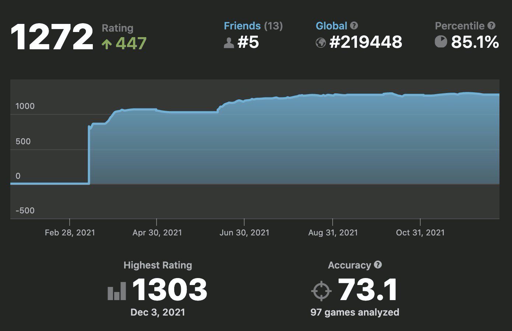
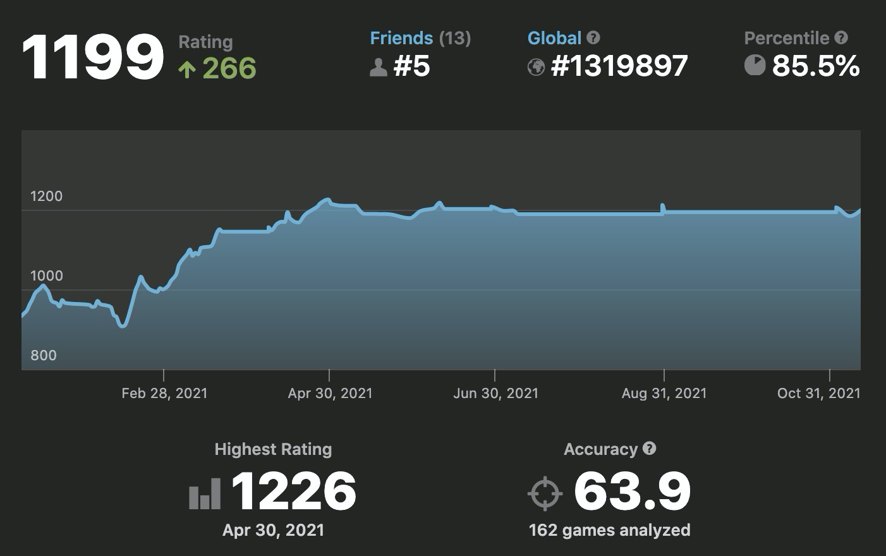
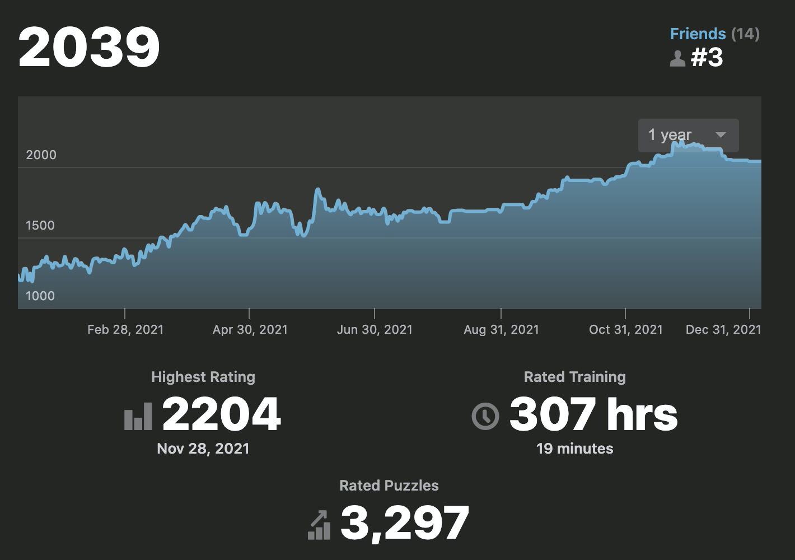

This year I'm partly following [Anthony Gustin](https://dranthonygustin.com/)'s [Annual Review process](https://docs.google.com/document/d/1K2P_yL1Ah976P7MLicb55wgY2DY-39jP3Lvp810H6HQ/edit#). In this post, I will share my responses to Steps 2 (Reflect on 2021) and 3 (Review 2021 Outcomes). I will also share personal statistics that I was able to collect during the year.

> Note: My last two articles on this blog have been "[2020 in Review](https://rasulkireev.com/2020/)" and "[2021 Goals](https://rasulkireev.com/2021-goals/)", which is not a good start.

### Table of Contents:
- [Stats](#stats-and-graphs)
  - [Writing in Obsidian](#writing-in-obsidian)
  - [Chess](#chess)
- [Goal Review](#goal-review)
  - [Overview](#overview)
  - [Lessons](#lessons)
- [Reflect on 2021](#reflect-on-2021)

## Stats and Graphs

### Writing in Obsidian

I have created:
- 523 [Tagnotes](https://www.youtube.com/watch?v=1NjMO-KKcJY)
- 172 ["Evergreen" Notes](https://notes.andymatuschak.org/Evergreen_notes)
- 1091 Total Notes

And a rough distribution of these notes looks something like this:

**Top 10 Backlinked Tagnotes in 2021:**

1. Chess - 21
2. Python - 18
3. Django - 18
4. Quote - 16
5. Ethereum - 12
6. Built with Django - 11
7. Web3 - 10
8. Smart Contract - 9
9. Guy Carpenter - 9
10. Cryptocurrency - 9

**Top 10 Backlinked Tagnotes Thus Far:**

1. Learning - 37
2. Writing - 28
3. Chess - 21
4. Python - 18
5. Django - 18
6. Journaling - 17
7. Habits - 17
8. Quote - 16
9. Community - 16
10. Obsidian - 15

Here is how the graph looks like (red are evergreen notes and green are tagnotes. everything else are notes for books, courses, people, etc.):

### Chess

There is not going to be much analysis just yet, since I have started the journey just this year. I have obviously improved a lot, but the real test will be in 2022. Will I be able to break 1500 or possibly 1700 to give a fair battle to my Dad? We will see. I think if I will naturally reach 1500 with videos, puzzles, and games, I will require something more concrete to continue the improvement. Something like a training plan with books, and specialized training.

**Daily**

**Rapid**

**Puzzles**

I have also played on lichess, but I think the chess.com rating system is a little more accurate.

## Goal Review

In this part I'll be looking at goals I have set for myself [last year](https://rasulkireev.com/2021-goals/).

I've split my goals into 6 categories as per Doist's [suggestion](https://blog.doist.com/annual-review/):
- Work
- Productivity
- Health
- Finance
- Relationships
- Learning

### Overview
I haven't been looking at my 2021 goals for most of the year, but luckily I was able to achieve most of them. I think the reason for that is that most of these goals were very well aligned with my internal state at the time, which didn't change much during the year.

#### Work (3/4) - A
- No title "promotion", but a big wage bump (~22%)
- Currently working on a [FastAPI](https://fastapi.tiangolo.com/) webapp at work.
- Have dropped building a Django course with [Newline](https://www.newline.co/).
- Had great progress on [Built with Django](https://builtwithdjango.com/)
	- [Started a podcast](https://builtwithdjango.com/podcast/)
	- [Built a Job Board](https://builtwithdjango.com/jobs/)
	- Haven't published any written interviews.

#### Productivity (0/3) - D
- Can't claim that I have written something down every day, or even most of the days for that matter.
	- I have picked up the [Readwise](https://readwise.io/) / [Obsidian](https://obsidian.md/) habit closer to the end of the year, which I hope to continue throughout the year.
	- Failed to consistently send a [personal newsletter](https://rasulkireev.com/newsletter/).
	- [Twitter](https://twitter.com/rasulkireev) not too consistent.
	- No new articles this year, however, published a couple of [book reviews](https://rasulkireev.com/book-notes/) and a [good Python/Ethereum tutorial](https://rasulkireev.com/creating-ethereum-token-with-python/).
- Didn't end up using Todoist for my tasks. The systems that I have tried seemed too cumbersome and unsustainable.
- Totally failed to use Anki for Language Learning.

This year when setting up goals for something similar to this section need to make more quantifiable goals. "Using Todoist" is not really a good goal, unless you are Todoist.

#### Health (0/4) - F
This is just a complete miss.
- Gained weight, lost muscles.
- Bad diet (even with some improvement, overall is just bad)
- Bad sleep
- Less exercise
- No meditation
- A lot of stress

Don't even want to continue. Health will be a huge goal for me this year. I did purchase an [Oura Ring](https://ouraring.com/) on Black Friday, hopefully, it will be easier to track those things.

#### Finance (2/2) - A+
Financially this has been a great year.
- I did earn some money from a side project on the internet. Surprisingly it was an [NFT project](https://www.cisterciandate.club/).
- I did pay off all my debts, mostly due to the bonus I have received at the beginning of the year.

#### Relationships (2/5) - B-
**successes**
- Join a club ✅. I did join a regular chess meetup in Newark. Even won one tournament. I also tried to start a small club in my building, but that didn't work out too well. Maybe I should try starting a club for board games, I do have a lot of those after all.
- Sponsor 5 people is probably too many. I think the fact that I'm [sponsoring two people](https://github.com/rasulkireev?tab=sponsoring) and donating to Wikipedia is very good already. With the increased rent rate I might have to scale this down a little. Actually, this will come as a point in the 2022 goals, but I imagine we will have to be a little cautious of our spending due to the increased rent rate this year.
- Didn't get any sponsors this year. Although the support I got for the Cistercian Date Club could be considered a sponsorship.

**failures**
- Unfortunately didn't do a lot to help my wife find her calling. I was supportive, but the pandemic took its toll, and nothing sparked a bunch of joy for her.

> Become more social
> - get 100 newsletter subscribers by the end of 2021
> - get 500 Twitter followers by the end of 2021

- Was not able to reach newsletter counts and Twitter followers goal as haven't been too active. However, if you take into account the Built with Django project, it would reach the goal, although I think I meant the personal accounts here.

#### Learning (3/8) - B
This is probably the "heaviest" group due to the number of goals. And really, those are just inspirations at the start of the year that can freely change during that year. So, I'll try to take that into account.

**successes**
- I think I became a much better Python programmer
- I haven't built 5 web projects, but a few projects that I have been working on involved me learning some of the tech I've listed. For example, React and D3js.
- I did not do a test, but I think my typing speed and accuracy have improved a bit.

**failures**
- not using vim for coding, and am not sad about that. maybe some other day
- did not reach 1600 in ELO rating and haven't beaten dad yet, but I have improved a lot. See some stats in the Chess section below.
- didn't buy any existing company
- didn't do too much open source contribution
- as mentioned earlier did not use Anki to learn Italian

### Lessons

1. How many did I hit?

   So, a quick calculation tells me that my success rate with 2021 goals is … 🥁 … ~38% which is not fantastic, but knowing the full story I would probably argue for ~65%.

2. Which three am I the proudest of and why?

   - I'm very proud of my ability to eliminate all kinds of debt from my life and about making my first money on the internet. I think these two are very important to think about when entering 2022. This should show me that anything is possible.
   - Another one I'm very proud of is me joining a chess club and playing with real people. Meeting with Daniil Chen for the New Year's helped me realize that Tanya and I are not meeting nearly enough people in our lives. And the only way to move forward is to meet more people.

3. Why did I miss the mark on any of them?

   Most of the tasks I did not complete were due to me changing course during the year, which is totally fine. The rest, it's hard to say. The first one that comes to mind is the health objective. And I'm not sure why exactly I have missed that one so badly. One thing that comes to my mind is the lack of a system. When I came up with a simplified system to make a note on the books I read it became much simpler and easier to convert this action into a habit. Creating a simple system, when it comes to diet and exercise shouldn't be too hard, but for some reason it is. One reason I think it is is that once you start a healthy habit you want to pile on many other things and this leads to a collapse of the whole system. To give you an example, I decided to go to the gym every other day and am successful at it, good. Then I add a good diet (lentils and meat), also good. Then I decide to meditate every morning, for that, I need to go to bed a little earlier, for that, I need to spend more quality time with my wife in the evening, for that I need to finish my work a little earlier, for that I need a little more time, this means, less cooking time or gym time during the day.
	As you can see, this quickly turned into a failed shit show. So this whole process needs to be a well-thought-out process. But in the end, it kind of depends on your Time Management and Work Efficiency.

4. Are these goals still important? If so, pull down to 2022 planning. If not, don't feel bad crossing them out and moving on.

   I absolutely think some of those tasks are still important, which is a good sign that I have created some decent goals for myself. Some others are not going to the next year's list, which is also fine.

5. What habits, people, routines, or environments supported me in reaching my goals?

   Even though I have succeeded in some goals I have set for myself, I can't say that it was any one habit that helped me do that. On the contrary, I didn't have any habits that would help me, so I was kind of going against the grain. In 2022 I want to spend more time building up those habits and systems as opposed to reaching specific small goals.

6. What habits, people, routines, or environments prevented me from reaching my goals?

   Some bad habits that were destroying me in 2021 are:

   1. phone in the bedroom
   2. late-night snacking

## Reflect on 2021

### 1. What were my major milestones or moments? What accomplishments am I most proud of?
- A 30% percent increase in my annual wage. This has been a big moment and is one of the first things that comes to my head.
- Doing a lot of good work for my employer (Guy Carpenter).
- Starting to do more Web Development at work.
- Greatly improved my Chess game and won a small tournament in Newark.
- Went to Costa Rica, which is the first "adult" vacation/trip I did with Tanya.
- Did a lot of work on the [Built with Django](https://builtwithdjango.com/) project.
	- Finally published [Built with Django Podcast](https://builtwithdjango.com/podcast/).
- Learned a lot about Web3 and about Cryptocurrency.
	- Created a small NFT project ([Cistercian Dates NFT](https://www.cisterciandate.club/)), which I yet have to finish.
	- Made 30x on a small [ConstitutionDAO](https://www.constitutiondao.com/) project.
- Made my own wine, and improved a lot in my cooking skills.

### 2. What are the people, events, habits, or tasks that I look back fondly, energized me the most, or made me feel the most expansive 2021? How can I do more of this in 2022?

- Traveling with Tanya to Costa Rica was certainly an energizing event.
- I certainly enjoyed participating in the Chess tournaments at Method Cafe. When I was playing chess in a tournament I felt a sense of deep focus and enjoyment, very similar to the Flow. The last time I remember feeling something like that was when I was playing Football.
- The feeling of progress (when you are learning something new) is something that is very addictive and positive. Whenever I can solve a problem that I have been stuck on for a while I am very happy.
- I haven't met many people that made me feel energized or expansive. In fact, a few gatherings I've been to, make me feel a little bad, because I'm not a social/extroverted person.
	- Although that said, I do remember that listening to [Sahil Lavingia](https://sahillavingia.com/) talk during one of the NYC gatherings was awesome. I felt so energized to work on small projects that will help me earn extra cash.
- Due to the pandemic, I've spent a lot of the time with my SO at home. There was one time I went to a sauna, alone (without my neighbor), and the 20-30 minutes I spent there were very enjoyable. I had some time to think, relax, come up with ideas, and recharge.
- I really enjoyed learning interesting facts about History through though [OverSimplified's videos](https://www.youtube.com/c/OverSimplified/videos).

So, what can I do in 2022 to feel more energized and expansive:

- Be a part of communities that I'm passionate about. Right now it is Chess.
- Go to the Gym and Sauna alone, more often.
- Read more History books and consider Writing blog posts on the events that interest you the most.
- Consider traveling in 2022. Maybe talk to Clay Hambrick about combining vacation with a business trip.
- Need to extend my network in the sense that I should meet more people and make more friends, like Daniil Chen and Elizaveta Chen.

### 3. What are the people, events, habits, or tasks that I dreaded, drained me the most, or made me feel the most contracted in 2021? How can I do less of this in 2022?
As mentioned above, large gatherings (ala networking) are certainly draining me out. This is pretty much it from a negative standpoint.

### 4. How did I grow as a person?
- I've grown in many different ways I'd say, with the most being professional. I have learned a lot of things related to my work over the last year. I have improved my code and my understanding of some general concepts. I still have a ton of room to grow, but that will be the truth any year.
- I'm not sure if I can claim to have grown intellectually, psychologically, spiritually, or physically, so this is certainly something that I'm looking forward to in 2022. I'll try to make sure that some of my goals are aligned with this point.
- I certainly want to grow as a family man too, as my relationship with Tanya has been good but not too much growth, and I want to improve that.

### 5. What were my favorite books, podcasts, articles, videos and how did they shape my thinking?
- As mentioned in question two I have really enjoyed learning about major historical events from the [OverSimplified channel](https://www.youtube.com/c/OverSimplified/featured).
- I have certainly listened to fewer podcasts this year, and I'm not sure this is something I want to change, will see how it goes. There are a ton of options after all.
- I have been enjoying audio versions of Blinkist Book Reviews. Maybe I can continue that and also include actual audiobooks. Hopefully, there is an app for listening to audiobooks and making notes like in Airr or Snipd.
- I have started a new book by [Ray Dalio](https://en.wikipedia.org/wiki/Ray_Dalio) recently and am enjoying that very much. It is a combination of Economics, Finance, and History.
	- I have been reading various books in 2021, but a theme of "entrepreneurship" books has occurred. Those books do provide some new/useful information, but more than that they are focused on motivating the reader on doing something.
	- I think I do have all the knowledge necessary to start my own business and earn some money with it. I think what I need is books that provide new info (History, Physics, anything that will teach me new, change my worldview).

### 6. How could I have been better as a person? Friend? Manager? Parent? Etc.
- I think my biggest role in 2021 has been of a husband and I could certainly make some better actions/decisions. I could have been a little annoyed at my spouse more than I should have. I could be a little condescending or impatient.
- Regarding my role of being a friend, I should certainly be reaching out to my friends more often, more than just their birthdays.
- Same goes for my role of being a brother. My sisters have been going off track on their life journey, and I think maybe I could help them by talking to them more often.
- In general, though, I think I have mostly been a good person, but there is always room to improve.

### 7. What am I most grateful for in 2021?
- I'm grateful for Tanya (my spouse), as we have been living in the same room for more than a year due to the pandemic. And even though, at times, it was difficult, overall we did fine. So, I'd like to thank her for her patience.
	- However, that said, I don't think that this can continue much longer without changing anything. So, in 2022 I want to help her find her calling. We will find a class for her that will help her learn something new and apply those skills to find something to do during this pandemic (which will last another 50 years, according to South Park 🤣)
- Grateful for my colleagues. I have learned a ton and have become a much better developer thanks to my colleagues at Guy Carpenter. I haven't been a part of many teams after graduation but know for a fact that the team I am a part of now is pretty much the best one could get.
	- As an extension of that, I am thankful for the company that I work for. Guy Carpenter allows me to work on the things that excite me and help me learn and become better. Furthermore, the conditions that I work under are very nice. Work-Life Balance is very good.
- Grateful for my family (dad, mom, and sisters). Grateful to my mom and dad for all the support they give me and Tanya.

### 8. What books did I read? Which ones were most impactful and why? What were the main takeaways?
Below is the list of books I read in 2021 (and made a note in Goodreads)
- [Doing Content Right](https://rasulkireev.com/doing-content-right-book-review/)
- [The Art of Learning](https://rasulkireev.com/the-art-of-learning-book-review/)
- [The Richest Man in Babylon](https://rasulkireev.com/richest-man-in-babylon/)
- [The Way of the Superior Man](https://amzn.to/3HVkBz1)
- [Atomic Habits](https://amzn.to/3r3SlDn)
- [How to Take Smart Notes](https://rasulkireev.com/how-to-take-smart-notes/)

All those books were influential in some way. I haven't implemented learning from these books as much as I would have liked.

For example, Atomic Habits gives a great framework for implementing systems that will help one with creating new habits, however, I have failed to follow the advice from this book.

The same goes for Doing Content Right which teaches a lot about creating content, however, I haven't created much content in 2021, which I plan to change in 2022.

The Richest Man in Babylon and The Art of Learning were a little different in the sense that the whole books are dedicated to a few main ideas and tell stories around those ideas. The first book did a good job of ingraining an idea of saving a portion of income and investing into businesses that will continue to bring income in the future, ala Microacqusitions. The Art of Learning "forced" the idea that (or at least how I understood it) to become an expert learner you need to approach new fields with a child-like curiosity and exploration. It further taught me a few good techniques to enter the state of Flow and Relax | relaxation.

As for the How to Take Smart Notes, it taught me a system of [Zettelkasten](https://zettelkasten.de/introduction/), which I'm implementing "as we speak".

### 10. What is currently stressing me out the most?
- #1 thing that is stressing me out is the accumulation of junk in our house. We are failing to get rid of things we don't need, but we keep accumulating more.
- Me being a little overweight and lacking Self-Control and Self-Discipline to take this under control.