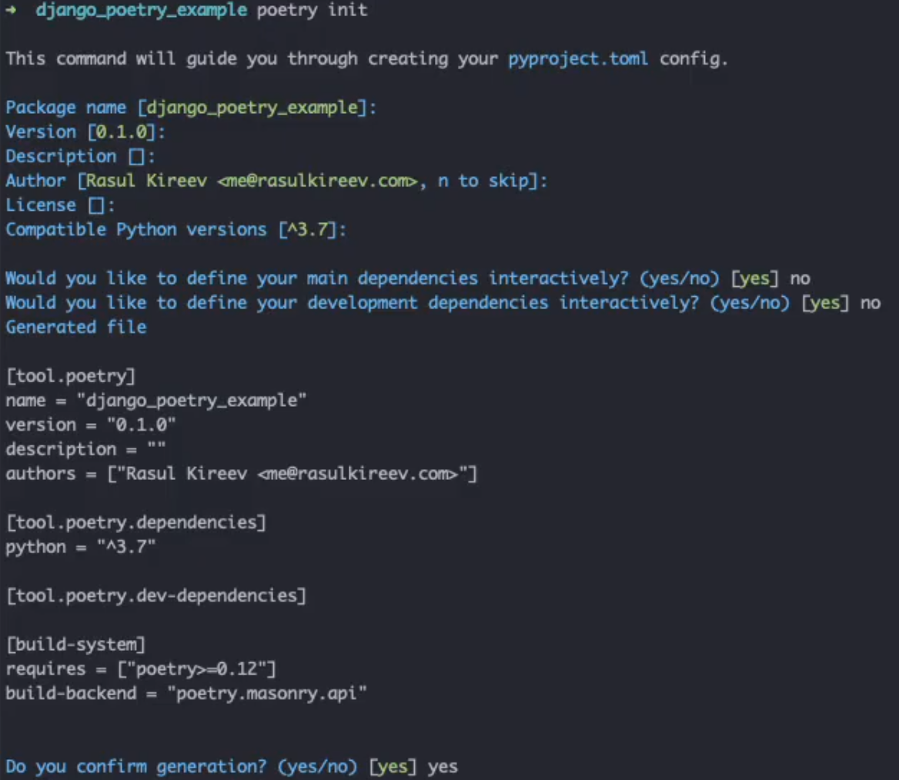

Poetry is a relatively new packagin and dependency manager. It makes it very easy upload libraries to PyPI, manage dependencies visually, and has a couple of handy features. Today, I'm not going to do a deep dive on how Poetry works and all it's features. Today I just want to focus on how to configure it for a Django project. 

## 1. Install Poetry

```bash
curl -sSL https://raw.githubusercontent.com/python-poetry/poetry/master/get-poetry.py | python -
```

## 2. Create a Directory for you Django Project

```bash
mkdir django_poetry_example && ls django_poetry_example
```

## 3. Initiate a Poetry Project

```bash
poetry init
```

You will be asked to confirm informatino about your project. You can skip through the most of it.



## 4. Add the Necessary Dependencies

Run `poetry add django`. Poetry will add `django` to the `pyproject.toml` file under the dependencies section. A virtual environment will also be created for you. 

## 5. Start you Django Project

```
django-admin startproject django_poetry_example .
```

## 6. Working on your Django Project

When you need to run any python function (for example, `python manage.py createsuperuser`) you have two options.

1. You can leverage `poetry run` which will run against current project's dependencies. The command will be this: `poetry run python manage.py createsuperuser`.
2. You can activate the virtual environment with `poetry shell`. Now you can run python commands, as is. They will be run with dependencies you have installed.

## Bonus. Export dependencies to a requirements.txt

If you need to have the `requirements.txt` file with all the dependencies you can run `poetry export -f requirements.txt --output requirements.txt`. If you have a configured a CI/CD job that auto deploys your project, you can add this function as a step, which will generate the updated version on each update.

## Bonus II. Video

If you prefer a more visual approach, I have made a video that shows how to start a Django project with Poetry.

https://www.youtube.com/watch?v=-c8DASfFNZM