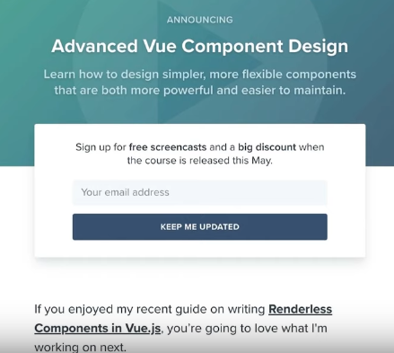
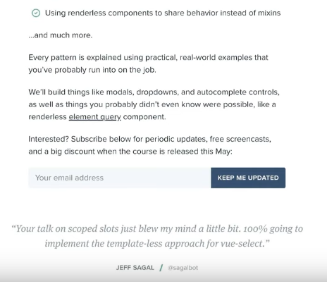
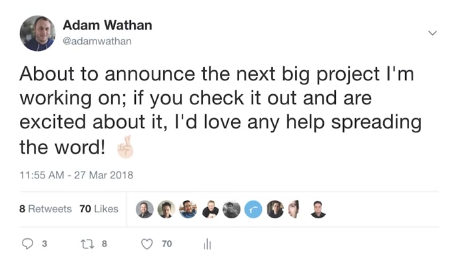
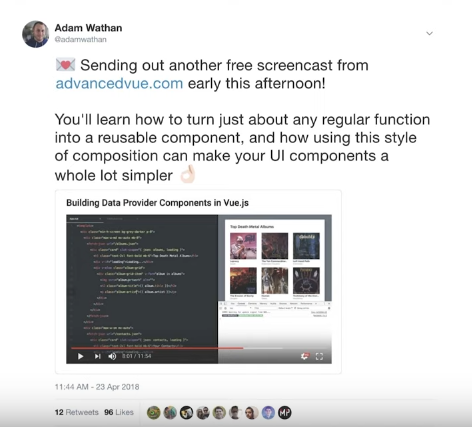
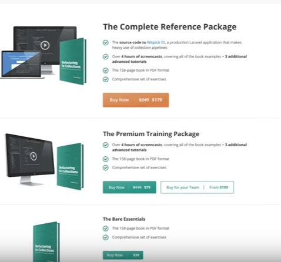

MicroConf founder Rob Walling recently made an announcement. All previous MicroConf talks are now in public access. This is incredible. You can access all talks on their [Youtube Channel](https://www.youtube.com/channel/UCHoBKQDRkJcOY2BO47q5Ruw).

> It seems very weird to me that there are only 2.6k subscribers as of 4/22/2020.

There is a ton of incredible content to go through.

One of the first videos that I have noticed was Adam Wathan's presentation on selling info products. I am a huge fan of Adam and his work. He had been producing incredible content for a long time. He has made more than $2.5 million from selling his products, so you might want to listen to this guy.

This talk is no exception. It is packed with useful advice. I urge you to watch the talk. It is only 40 minutes long. In case you don't have the time, I hope you will find the notes I made useful.

I couldn't resist making these notes. I will be leveraging them heavily going forward. I am thinking about creating a book about Gridsome. To be more specific on how to create a personal website with it. Thanks to Adam, I have a clear roadmap on how to make sure my future product is successful.

Please enjoy!

---

## Why Info Products (books, courses)?
* One-time purchase is easier to sell.
* Much easier to finish. There is an end in mind.
* The payout is the opposite of SaaS (starting low and getting higher). You will sell a lot and then go down.

## Step 1. Build an Audience
* This is the most crucial step for any future success.
* One of the advantages is that audience makes up for any deficiency in your marketing.

**How do I build an audience?**
* **Be helpful on the internet**.
* Help people where they are (in a Twitter timeline, for instance.)

## Step 2. Come up with an Idea
**How to come up with an idea?**

Ideas will come to you! Post useful stuff, people will engage, and ideas will come. No need to sit and brainstorm.

> Make sure to record ideas when they come to you.

Tips on coming up with ideas for an info product:
* What are people liking from what you post?
* What are **you** excite about, that other people might be excited about.
* What did you have to figure out yourself but was helpful to learn?
    * Can you make it easier for others to learn this?

## Step 3. Test your Idea

1. Do "tip tweets" for the subject you plan to produce.
2. If this gets traction, do something more in-depth like a blog post.

Tip: Catalog any useful feedback you get about your content. Twitter replies, blog post comments, etc. Not only will this direct you, but it will also be reused later.

## Step 4. Create a Landing Page

These are the things you need on your Landing page:

1. Headline
2. Short Description
3. Call to Action: Signup to Email Newsletter
    * Tip: make sure to provide an incentive: e.g., free screencasts, discount on launch.
4. Proof that you know some of this stuff. Link to a blog post, for example.
5. Social Proof: Testimonials, use the Tweet you saved earlier.
6. Outline what you are going to include. No need to go too in-depth.
7. Another signup form on the bottom.

8. "Who am I" section.

[Adam's Advanced Vue Course - Example](https://adamwathan.me/advanced-vue-component-design/)

## Step 5. Build an Email List

1. Tell your audience about your launch.
    * Tell them you have a landing page where they can sign up.
    * Announce that you are about to announce your landing page.
    

2. **Share Progress** with your email list.
    * Every week or so, send an updateCreated to your audience. Include a free video or a link to a live stream.
    * Every week or so, send an updateCreated to your audience. Include a free video or a link to a live stream.
    * Share before sending an email. Tweet to your audience that if they want to receive some free stuff to go ahead and signup.
    

3. Repurpose Content.
    * Taking a chapter from the book and massaging it into a blog post.
    * Add a signup form to that post.

## Step 6. Getting it finished
1. Make **public promises** to your audience.
2. **Email on Schedule**. Once a week is good.
3. **Reduce Scope**, if you can't finish, but have produced good material already.

## Step 7. Figure out Pricing

### 1. Tiered Pricing

**Single Tier**
* Can be fine if you charge enough
* Often necessary if pre-selling
* Nice if you can't figure out a way to add extra tiers that actually feel valuable

**Two Tiers** - Wes Bos Example
Real product id the "upper" tier. "Lower" tier is like a crippled version of the "upper" tier. The real goal of that "lower" tier is to "push" people towards the upper tier. 2 products are $10 apart, but the second one has twice as much content.

Works well with video courses.

**Three Tiers**
* great for books if you can come up with bonus content.
* Makes it easier to evaluate as its own product instead of comparing to Amazon book prices
* Prices are usually 1, ~2, ~5x.
* This will make you a lot more money from a book than selling the book on its own.

### 2. Launch Discounts
* Discount it by enough to be appealing, at least 30%
* Use stepped discounts. Lower discounts on cheaper tiers and better discount on higher tiers
* Reverse engineer non-discounted price from your planned discounted price
    * i.e., If you want to charge $100 for your course and want to create a 30%, don't apply that discount to $100. Rather price your product at $143 (100 / 0.7), which will turn into $100.
    * We all have a tendency to undervalue our own work.

## Step 8. Nailing the Launch

**1. Build a Sales Page.**
* Don't try to sell too hard, since most of the visitors will come from an email.
* Still include a signup form that sends preview content for new traffic, i.e., "Signup to get 4 free preview lessons."
* Testimonials and Social proof are important; use feedback from preview content to start.
* Sort tiers from highest to lowest price, use visuals to communicate to higher tiers.

**2. Announce the Launch Details**
* Send an email notifying people you include the following:
    * Include al package and pricing details
    * Complete TOC or content list
    * Final free content if possible

**3. Launch it**
* Send a super-simple email, saying it's done and a link.
    * Sending on Tuesdays seem good day to send to Adam, not stats.
    * Morning EST works well for Adam.

**4. Leverage Early Feedback**
* Collect the feedback.
* Use it in a follow-up email to people who did not buy the course.

**5. Closing the Launch**
* Email to notify people that this is the last email where you can buy this at this price. LAST CHANCE!
* Don't specify a closing dateCreated in advance.
* Don't specify a closing dateCreated in advance.

---

## Other tips:

### Books vs. Video Courses
* Plan small; it will end up bigger than you think
    * Short books are still books
    * 3 hours is plenty for a video course
* Books are a lot easier to work on, especially if you only have short blocks of time.
* Courses are easier to sell at a higher price but a lot harder to produce on nights and weekends.

### Should I pre-sell?
**Advantages**:
* best form of product validation
* you'll make more money since you can talk about your product more often. With every updateCreated, for instance.
* you'll make more money since you can talk about your product more often. With every updateCreated, for instance.
* more motivation to finish

**Disadvantages**
* Selling multiple tiers is trickier
* Can't easily change the scope
* Can be extremely stressful

## Resources
* [Nailing Your First Launch - MicroConf Presentation](https://www.youtube.com/watch?v=ajrDxZRpP9M)
* [The Book Launch that let me quit my job - Adam's Post](https://adamwathan.me/the-book-launch-that-let-me-quit-my-job/)
* [Tools for selling your product online - Adam's List](https://gist.github.com/adamwathan/30dc4230ac575cfa3425b39ca11ea859)
