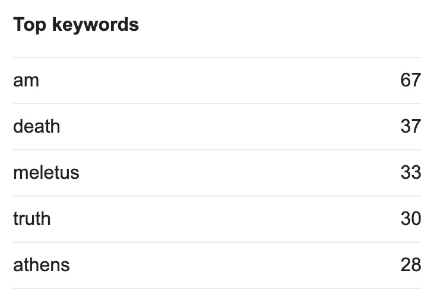
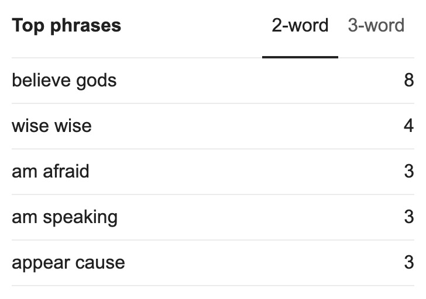

## Summary

The Apology is Plato's record of the speech given by Socrates in court as he tries to defend himself in 399BCE against the accusations of "corrupting the young, and by not believing in the gods in whom the city believes".

There are three parts to this work (Spoiler Alert).

1. Socrates defends himself against accusations.
2. Socrates argues for various punishments after the jury finds Socrates guilty.
3. Socrates' last words after the jury condemns Socrates to death.

## My Thoughts

These are 3 very different "scenes". And we get to see Socrates in each one of them. It is fascinating to see what arguments Socrates comes up with and how he presents them to the public. It is very inspiring to see how a man handles himself when sentenced to death.

For me, this work has the highest ratio of notes to words (ie. how many notes I took compared with the size of the work).

Here are some life lessons that I have picked up from this work:
- You should always show humility by assuming that you don't know something. If you always assume that you know everything, you can't really learn anything new.
- We only fear death because we know nothing about it. In fact, death is the ultimate test to "we fear what we don't know" since it is likely we will never find out what happens after death.
- Start by trying to improve yourself, not others.
- "Good men" don't spend much time thinking about how to avoid death, but rather they think about doing good deeds. That's all that matters.

Some interesting stats:

## Highlights

If you [read this online](https://via.hypothes.is/http://classics.mit.edu/Plato/apology.html), you can see all the notes I made with [Hypothes.is](https://web.hypothes.is/). And if you make an account for yourself we can enter a discussion there.

---

So I left him, saying to myself, as I went away: Well, although I do
not suppose that either of us knows anything really beautiful and good,
I am better off than he is - for he knows nothing, and thinks that he knows.
I neither know nor think that I know. In this latter particular, then,
I seem to have slightly the advantage of him.

---

I must say that there is hardly a person present who would not have talked
better about their poetry than they did themselves. That showed me in an
instant that not by wisdom do poets write poetry, but by a sort of genius
and inspiration; they are like diviners or soothsayers who also say many
fine things, but do not understand the meaning of them.

**Note:** Interesting view on how poets write poetry.

---

and if
he is not wise, then in vindication of the oracle I show him that he is
not wise;

**Note:** Probably not very smart to tell someone why they are not smart.

---

Come hither, Meletus, and let me ask a question of you. You thinka great deal about the improvement of youth?

Yes, I do.

Tell the judges, then, who is their improver; for you must know,
as you have taken the pains to discover their corrupter, and are citing
and accusing me before them. Speak, then, and tell the judges who their
improver is. Observe, Meletus, that you are silent, and have nothing to
say. But is not this rather disgraceful, and a very considerable proof
of what I was saying, that you have no interest in the matter? Speak up,
friend, and tell us who their improver is.

The laws.

But that, my good sir, is not my meaning. I want to know who the
person is, who, in the first place, knows the laws.

The judges, Socrates, who are present in court.

What do you mean to say, Meletus, that they are able to instruct
and improve youth?

Certainly they are.

What, all of them, or some only and not others?

All of them.

By the goddess Here, that is good news! There are plenty of improvers,
then. And what do you say of the audience, - do they improve
them?

Yes, they do.

And the senators?

Yes, the senators improve them.

But perhaps the members of the citizen assembly corrupt them? -
or do they too improve them?

They improve them.

Then every Athenian improves and elevates them; all with the exception
of myself; and I alone am their corrupter? Is that what you
affirm?

That is what I stoutly affirm.

**Note:** I found this very funny from Socrates.

---

a man who is good for anything ought not
to calculate the chance of living or dying; he ought only to consider whether
in doing anything he is doing right or wrong - acting the part of a good
man or of a bad.

---

For this fear of death is indeed the pretence of wisdom,
and not real wisdom, being the appearance of knowing the unknown; since
no one knows whether death, which they in their fear apprehend to be the
greatest evil, may not be the greatest good.

---

he who will really fight for
the right, if he would live even for a little while, must have a private
station and not a public one.
I can give you as proofs of this, not words only, but deeds, which
you value more than words. Let me tell you a passage of my own life, which
will prove to you that I should never have yielded to injustice from any
fear of death, and that if I had not yielded I should have died at once.
I will tell you a story - tasteless, perhaps, and commonplace, but nevertheless
true. The only office of state which I ever held, O men of Athens, was
that of senator; the tribe Antiochis, which is my tribe, had the presidency
at the trial of the generals who had not taken up the bodies of the slain
after the battle of Arginusae; and you proposed to try them all together,
which was illegal, as you all thought afterwards; but at the time I was
the only one of the Prytanes who was opposed to the illegality, and I gave
my vote against you; and when the orators threatened to impeach and arrest
me, and have me taken away, and you called and shouted, I made up my mind
that I would run the risk, having law and justice with me, rather than
take part in your injustice because I feared imprisonment and death. This
happened in the days of the democracy. But when the oligarchy of the Thirty
was in power, they sent for me and four others into the rotunda, and bade
us bring Leon the Salaminian from Salamis, as they wanted to execute him.
This was a specimen of the sort of commands which they were always giving
with the view of implicating as many as possible in their crimes; and then
I showed, not in words only, but in deed, that, if I may be allowed to
use such an expression, I cared not a straw for death, and that my only
fear was the fear of doing an unrighteous or unholy thing. For the strong
arm of that oppressive power did not frighten me into doing wrong; and
when we came out of the rotunda the other four went to Salamis and fetched
Leon, but I went quietly home. For which I might have lost my life, had
not the power of the Thirty shortly afterwards come to an end. And to this
many will witness.
Now do you really imagine that I could have survived all these
years, if I had led a public life, supposing that like a good man I had
always supported the right and had made justice, as I ought, the first
thing? No, indeed, men of Athens, neither I nor any other.

**Note:** All of this is about fighting for ideals in private vs. public. And Socrates argues for doing that in private for safety and maximum reach.

This kind of goes with my thinking. As much as I would change certain things back at home, I don't want to expose myself by going into politics. I would much rather try to improve my nearest surrounding "in private".

---

Socrates, but cannot you hold your tongue,
and then you may go into a foreign city, and no one will interfere with
you? Now I have great difficulty in making you understand my answer to
this. For if I tell you that this would be a disobedience to a divine command,
and therefore that I cannot hold my tongue, you will not believe that I
am serious; and if I say again that the greatest good of man is daily to
converse about virtue, and all that concerning which you hear me examining
myself and others, and that the life which is unexamined is not worth living - that you are still less likely to believe.

**Note:** Socrates is not willing to go against his nature and principles and shut up just to avoid death. He feels that his obligation to gods is to spread the "truth" and his ideals.

---

For often in battle there is no doubt that if a man will throw away his
arms, and fall on his knees before his pursuers, he may escape death; and
in other dangers there are other ways of escaping death, if a man is willing
to say and do anything. The difficulty, my friends, is not in avoiding
death, but in avoiding unrighteousness; for that runs faster than death.

---

For if you think that by killing men you can avoid
the accuser censuring your lives, you are mistaken; that is not a way of
escape which is either possible or honorable; the easiest and noblest way
is not to be crushing others, but to be improving yourselves.

---

Let us reflect in another way, and we shall see that there is great
reason to hope that death is a good, for one of two things: - either death
is a state of nothingness and utter unconsciousness, or, as men say, there
is a change and migration of the soul from this world to another.

**Note:** Socrates remains calm & positive about his death sentence.

---

Wherefore, O judges, be of good cheer about death, and know this
of a truth - **that no evil can happen to a good man**, either in life or after
death.