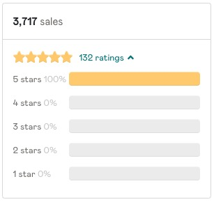

## My Thoughts

Doing Content Right by [Steph Smith](https://stephsmith.io/) is not just a regular book and should not be judged as such. Think of it like a written course, where in addition to the "book" that Steph wrote you will get access to:
  - live cohorts
  - private AMAs
  - bonus podcast events
  - bonus podcast chapters
  - private Telegram Community
  - exercises that will help you nail down the main points
  - various spreadsheets that Steph came up with to help her manage her life
  - and all of this just to this date, who knows what she will come up with (as of December 2021)

For anyone remotely interested in producing written content, I strongly recommend you purchase that book.

One thing to note is that since I have purchased the book, the price has increased slightly, and it now costs $200. If you should still buy it or not, I can't say, it all depends on how much money you've got to spend. But what I can say is that you will enjoy reading and learning anything that Steph has to share.

If you don't believe me look at those reviews...

## Summary

As you will see in the [highlights](#highlights), the book consists of five parts:

1. [Your Personal Monopoly](#chapter-1---your-personal-monopoly)
2. [Building Your Home](#chapter-2---building-your-home)
3. [Distribution](#chapter-3---distribution)
4. [Search Engine Optimization](#chapter-4---channels)
5. [Monetization](#chapter-5---monetization)

Steph is taking you on a journey from figuring out what you can write about all the way to earning money from it. Here are the key ideas that you will see in this book that will help you achieve your goals in writing.

- In order to succeed with your writing you either need to come up with something new and relevant, or improve something that already exists.
- Don’t write just to “make money”. Write to solve problems. Money should always be a byproduct of your creations, not the original intent.
- Start with something niche and branch out as you go along and make a good habit of writing and publishing.
- When it comes to your digital home there are many options, so try to keep it as simple as possible. Prefer to pay a little bit to own your content and your distribution. [Ghost](https://ghost.org/) is a great option, you can pay $9/month and they will handle all the technical details. If you are at least a little tech-savvy, you can host your Ghost blog on [Digital Ocean](https://m.do.co/c/a2a2c0826ff3), this will cost you around $5/month. If you don't want to pay, [Substack](https://substack.com/) is probably your best bet.

These are my major learnings from all the chapters apart from Distribution and SEO. Unfortunately, there is no one thing that I can summarize about those chapters. The majority of the book is focused on those topics. A highlight of what you might see is below.

If I had to summarize, I would do it like this:
- Write and publish ofter.
- Keep the blog simple.
- Produce useful content.
- Talk to your audience to gather feedback.
- Think about your content, make sure it is discoverable via search engines.
- Don't charge until you gather a substantial following.
- Have fun.
- Own your content, then syndicate to other platforms.

## Highlights

### Do Me A Favor
So remember, your goal in building a newsletter or blog is not to write articles or send emails. It is to create things that people love and find value in. Never forget that.

### Chapter 1 - Your Personal Monopoly

The world doesn’t need more of the same thing. Much less, do we need more of the same thing executed to a lesser degree. But here’s what the world will always have room for:
- The new, should it be relevant
- The old, should it be even just 1% better

What space can I be an innovator in? (the new, should it be relevant), or How can I disrupt an existing space, such that I am starting a new curve? (the old, should it be even just 1% better) In other words, can I either identify a new problem or be better at solving an existing one?

#### Why It’s Not Too Late Starting in 2020

“We are drowning in information, while starving for wisdom. The world henceforth will be run by synthesizers, people able to put together the right information at the right time, think critically about it, and make important choices wisely..” — E. O. Wilson

Remember, if your product—in this case, content—is not better in some way, none of the other stuff will matter.

Anything that you’ve spent an above average time learning about can be translated into information that is going to be valuable to the average person.

“idea ikigai”. It’s a simple concept, where you ask yourself, “What is something that I can uniquely contribute?” that is at the intersection of (1) interesting, (2) doesn’t exist in its exact form, and (3) that you have unique exposure to

#### Your Personal Monopoly

You don’t have to stay niche, but it’s good to start specific. It’ll make identifying and targeting your audience easier and it’s always easier to increase scope versus decrease scope.

Many “big” writers now have relatively vague value propositions, but I can assure you that many started with a focus. Shane Parrish focused on mental models for Wall Street, while Tim Ferris was known for his Four Hour Workweek. Now, they write about a myriad of topics because they have slowly gained trust

What is a true fan? It is someone that benefits from your solution a disproportionate amount.

Talking to your audience early on can also save you hundreds of hours in the future.

Don’t write just to “make money”. Write to solve problems. Money should always be a byproduct of your creations, not the original intent.

For example, I often start by sharing my articles on my Tier 1 channels (more about this in the Distribution section). With the case of my most popular article How to Be Great? Just Be Good, , I only posted it on Hacker News, Twitter, and Dev.to. The following week, when I went to post it in other places, I found that largely my job had been done for me. Complete strangers found value in the post and decided to share it across Reddit, newsletters like Software Lead Weekly, Facebook, etc.

Don’t make the mistake of not exploring rabbit holes.

### Chapter 2 - Building Your Home

As James Clear says in Atomic Habits, “I didn’t start out as a writer. I became one through my habits. Of course, your habits are not the only actions that influence your identity, but by virtue of their frequency they are usually the most important ones.

Or, as Malcolm Gladwell says in Outliers, “Practice isn’t the thing you do once you’re good. It’s the thing you do that makes you good.”

### Chapter 3 - Distribution

#### Thinking In Formulas

It is still better to write a great article, even if it takes 5x the time, because average articles are a waste of an “at bat”. It’s like sending an average Joe up to bat for the Yankees.

So remember: it’s better to write 10 top 1% articles than infinite average articles. Do whatever it takes to bring your articles into that top 1%

#### Brick by Brick

Even Ryan Holliday’s first 50 subscribers were his friends.

never underestimate the power of “weak ties”, a term in social psychology that differ from “strong ties” (ie: close friends, family, etc), in that they tend to be more casual acquaintances or just people with a common cultural background. I first learned of this concept in Adam Grant’s book Give and Take, where he explained that your “strong ties” network, by nature, is relatively small and they tend to give you redundant knowledge. They’re prone to know the same people as you and engage with the same things. But weak ties, on the other hand, offer more novel avenues of opportunity—they operate in different circles, know of different opportunities, and likely have a fresh perspective. And this concept has been backed by research: Sociologist Mark Granovetter identified the people were 58% more likely to secure a job by route of their weak ties, relative to their strong ones.

So as you start out, don’t only reach out to your strong ties (ie: your mom!)... reach out to previous professors. Reach out to old colleagues. Reach out to anyone that might give you a spoonful of novelty.

This concept of weak ties is also why participating in communities can be so impactful. People learn to recognize your name and although you haven’t necessarily developed a 1:1 connection, there is a sense of camaraderie between the bunch and people are surprisingly happy to go the extra mile to support you.

#### Channels

For example, people will ask the user to “Sign up for my newsletter” or “Get weekly updates”. But no user truly wants to sign up for your newsletter or get more emails. What they want is to “upgrade their marketing” or “get insider tips” or to “be ahead of the game”.

Taking this a step further, what they want is to sound smart in front of their boss or secure their next job or become more productive. It’s important that your modal copy speaks to the value that you’re providing for them.

Don’t label the action, but speak to the value you’re providing. Speak in their language. Clearly establishing your value proposition early makes exercises like this much easier. For example, Farnam Street uses the copy “Noise cancelling headphones for the internet” and doesn’t even use the term “email newsletter”. Source: Farnam Street The same goes for the call-to-action (CTA). Instead of using terms like “Subscribe” or “Join our newsletter”, you may consider using verbs that again, speak to the incentive of the reader, like “Get Smarter”, “I’ll Try Free Charts”, or “Get New Case Studies”.

Another trick is to be very clear about when you’re sending your newsletter (weekly, every Tuesday, etc). This reassures the potential subscriber that you have a clear intention of how you’ll use their opt-in, instead of some unknown marketing blackhole.

The obvious benefit of this approach is that humans love “free” stuff, even if they don’t necessarily need it. And since people struggle to put a price on an email subscription, adding an asset like this can improve conversions significantly. The downside to this approach is that often people are just looking for the magnet and are more likely to churn or be under-engaged with your list, even though you’ll still be paying for them.

When someone subscribes, this tends to be when most readers are most engaged. They’ve just found something you’ve produced valuable enough to subscribe, so this is your opportunity to really secure that impression for the long-term.

Pocket has been a huge source of traffic for me, but unfortunately, I don’t know if there’s a way to game this system. I “save” every article that I publish on Pocket, since it takes 5 seconds, but you need many more saves for an article to trend on their platform or be shared in their newsletter. If either does happen, it can be an incredible boost—getting featured in their newsletter twice has brought in nearly 80k sessions.

I also save every article in one of my six “magazines” on Flipboard. The nice thing about Flipboard is that it automatically syndicates the pieces to the Flipboard network based on tags that it automatically detects.

If you are just starting out on social channels, you can grow in the early days by engaging with people that already have audiences. You can do this in simple ways, like commenting on their threads or by sharing their work. But don’t just share it blindly—add value!

At the beginning of your Twitter journey, participate actively in niche communities (outside of the platform).

you don’t need to follow everyone that follows you. In fact, I encourage you to curate your channel such that you are following only people that deliver value to you, so that you are not only reading the most valuable content, but you also have the highest likelihood to participate in the discussions that you want to be involved in.

I take this a step further and limit who I follow to 99 people—not because I want to look cool, but so that I’m ensuring my feed stays high quality. Each new person that I add is removing attention from someone that I’m currently following. So, each time I follow someone new, I remove someone from the list that hasn’t been delivering value.

On social, people like following people, not companies:

In addition to following specific people, you can get notified (bell icon) when someone tweets, so that you can participate in those discussions.

You may not always have something interesting to say, but if you act as a facilitator, others will do the work for you. The easiest way to do this is to simply ask questions that strike the right balance between 1) being broad enough to involve many people (ie: not some niche topic that only 1% of Twitter has heard of), but 2) interesting enough that people still want to get involved (ie: they can have something unique, helpful, and/or smart to say).

Instead, people have found success in capitalizing on a single topic. I did the same, where at least early on, I would focus on indie making and remote work. People started to recognize me for these things and would loop me into conversations about those topics.

“The 1st golden rule is to ask is “why people should follow me.” Then you consistently post content that supports that why.”

People tend to use your bio as a place to brag about their accomplishments, but it’s also real estate that you can use to convince people to follow you. If you’re a writer, you can say something like “Writing about X”, so that people know what to expect when they follow you.

Make sure that your pinned tweet is related to your “thing”, and not just your most upvoted tweet. For example, even if a tweet of yours went viral for its humour, but you tweet mostly about venture capital, go with a popular tweet about venture capital.

The simplest way to be retweetable is to say things that many people think, but often won’t know how to say themselves. You could call this a “contrarian truth”.

I wrote about how you can submit to these publications in more depth here, but the key is to get accepted as a contributor to a few relevant publications and then the submission process gets much easier each time. Each publication generally has its own submission process, but you can find relevant publications through this spreadsheet or use the tool Smedian.

Another option for distribution is to take your written word and turn it into video, audio, or imagery.

Most people think that Pinterest is for mommy bloggers and interior design. Those areas are popular on the platform, but you’d be surprised at the diversity of content on there. For example, NerdWallet has a Pinterest account with over 3k followers that covers anything from lines of credit to mortgage scams to business travel tips. Even with their 3k followers, as of writing this, their account actually gets 1.4m monthly viewers!

If you’re just starting out, you may consider guest posting on other publications. Effectively, you would be trading your time in order to access a larger audience. Because it’s not the same reciprocal trade as with partnerships, they can be very time consuming.

In addition to cross-promotions with other creators, you can benefit from connecting with other curators. I would encourage you to start building these relationships, before you ask for anything. For example, I regularly reply to newsletters that I read, just to give my thoughts, share related content, and in general, build a relationship.

I think that forming relationships with newsletter curators is one of the most under-utilized approaches. Some people approach this incorrectly, sending out mass blasts to dozens of curators. Instead, focus on building genuine relationships and only pass along material that is truly relevant.

Make sure that you are spending time with communities that are highly engaged.

You can use SimilarWeb to keep a pulse on where other publishers are getting their traffic. For example, if we take a look at NerdWallet on SimilarWeb, it tells us a bunch of valuable information, including which keywords they’re ranking for and which social channels are driving their traffic, but also which publishers are directing traffic to NerdWallet and other websites that NerdWallet users tend to visit.

#### 12 More Quick Wins

David Ogilvy is: “On average, five times as many people read the headline as read the body copy. When you have written your headline, you have spent eighty cents out of your dollar.”

Quote your piece: Related to the last tip, give your audience something to fixate on by highlighting quotes within your piece. This not only puts emphasis on the most impactful takeaways, but gives them ideas of what to share.

#### Small Stuff

People are busy and subscription fatigue is a very real thing. Do not write a long email, just to fill the space or hit a specific character count. Focus on your newsletter providing value and not how long you think it should be.

The focus should be on continuing to produce. Every article created and distributed with care is another shot; another “at bat”. And as you continue to take more good shots, one will hit. I promise.

### Chapter 4 - Search Engine Optimization

#### The TL;DR of Ranking Factors

And in order to understand the algorithm, you can focus on the fundamentals that Google is focused on. It prioritizes content that is CRU: Credible (high quality) Relevant (to the query) Usable (for the searcher)

#### Using Ranking Factors Correctly

If you’ve selected a good primary keyword, it will have the right intent, it will have search volume likely in the range of hundreds to low thousands (again, unless you’re Forbes), and the current articles ranking for that particular keyword will have a domain authority similar to or below yours.

Another example of this happening is with Calvin Rosser, who has been writing online since late 2017. Throughout much of 2018, he was writing consistently and had published dozens of articles and book summaries. Despite actively writing so much, his organic traffic wasn’t increasing at all. In 2019, as part of his mission, he decided to give back through scholarships. In order to get more applicants to his scholarships, he reached out to universities that featured his scholarships on their site. From this project, he quickly built up over 100 new referring domains and his organic traffic responded accordingly, even though he wasn’t actively publishing at the time.

#### Getting More Links

Use other assets you own: The easiest way to build a few links at the beginning is to use any resources that you can actually control. This may seem obvious, but is often forgotten. Did you launch a side project back in the day? Do you have a personal website? You can link to your blog from these other properties. An easy way to do this is simply by adding something in the footer of all your products that says, “This site was made by [insert your name here], founder of X, Y, Z”, where X, Y, and Z are links to each product that you’re looking to build links to.

Build your own link-building team: Another option is to be or build your own internal link-building team. Practices for link-building are pretty widely documented, like the skyscraper technique or targeting broken links, both of which are widely used. These tactics work, but I would still caveat that these direct response link-building techniques are very competitive and unless you have experience in this area, you may end up wasting a great deal of your time without significant results.

Interview others: On the flip side, you can conduct interviews. It’s a universal phenomena that most people like sharing their opinions and that’s why even super successful people can be found doing interviews on smaller sites. Links are unidirectional, so just the act of conducting the interview and linking to their pages won’t do anything for you. But, what you’ll typically see is that the interviewees are happy to share the interview on their channels and if they have a big following, this can lead to some solid links. If you have a decent domain authority, there is also the possibility to rank for that individual’s name on Google. If you decide to employ this method, just make sure to send a solid follow up email notifying your participant of the article going live, prompting them to share it. A great example of someone doing this is Tomas Laurinavicius that has interviewed a couple dozen people in the productivity space about their habits and routines. If you look at his link profile, many of his backlinks come from these interviews.

Give reviews: Contact your favourite products with a testimonial and see if you can get on their homepage, as Founder or Creator of X (with X being the link to your website). This is only great for brand awareness, but for that extra link juice! Not every site will agree to feature your testimonial or include a link, but this can be a quick way to get a few high-quality ones! If you already have a testimonial on another site without a link attached, take a minute to reach out and see if they’re willing to add it in.

#### Case Studies: Associated Problems

The best advice to avoid getting “ruined” by an algorithm update is to focus on two things that never change: always put the user first and try your best to diversify your content (ie: don’t have all of your organic traffic coming from a single page).

#### Best Practices

focus on making your publication more: Credible (high quality) Relevant (to the query) Usable (for the searcher) People often ask which factors are most important. The answer is “yes”. You need to have a credible (high DA), relevant (to the query), and usable article in order to rank. There is no way around it.

If you learn to use the data Google provides effectively, I promise SEO will become less like a black box, and more like a treasure hunt.

### Chapter 5 - Monetization

#### Don’t Trade Trust Down the Road
Consider that there are many ways to get to the finish line. For example, if your goal is to make $5k/month, that could be by selling: 10 courses at $500 50 subscriptions to your paid newsletter at $10 A single $5k consulting gig 2500 sales of an affiliate offer returning $2 Some combination of the above and more

#### Affiliates
Gumroad makes it incredibly easy to set up an affiliate program, so if you see a Gumroad product out there that you have taken or want to take, reach out to the creator to see if they would consider doing an affiliate deal with you. Chances are, they will.

#### Finding Sponsorships
My final piece of advice when it comes to newsletter sponsorships is to create what I call a promote page. A promote page houses all of the basic information that someone would want to know about advertising with you, but also has direct links for them to pay at their own accord. This will help you with both inbound and outbound requests and I view it as a more modern “media kit”.

#### Products
However, since you know your audience best, creating your own products might be your best way to: Turn your publication into a business, while… Continuing driving value to your subscribers

#### Software
If you have an audience, you could create anything from mobile apps, to browser plugins, to website themes, or the most popular product selling on Instagram… Lightroom presets

#### Services
with many YCombinator companies. Even if you don’t monetize your publication directly, you will almost certainly get other opportunities from it—

### Chapter 6 - Extras

#### Biggest Mistakes
Instead of spending 90%+ of your time on writing, make sure to balance that more proportionally with distribution. Even if that means that your publishing cadence must suffer, do it.

make sure to test out different channels consistently, until you find a few that really work for you.

consistently invest in bedrock channels, so that you build up a machine that runs, even while you are asleep!

for reversible decisions, the best thing you can train yourself to do is build a habit of taking action.

Knowing where you want to get is a powerful force, even if you don’t know exactly how you’ll get there.

One way to embody this approach is to simply ask yourself this every morning, “What can I do today that will help me get closer to my goals?”

Bill Gates once said, “Most people overestimate what they can do in one year and underestimate what they can do in ten years.” Similarly, people overestimate what they can do in a day. So, amongst the inevitable noise make sure that every single day you are taking at least one step forward.