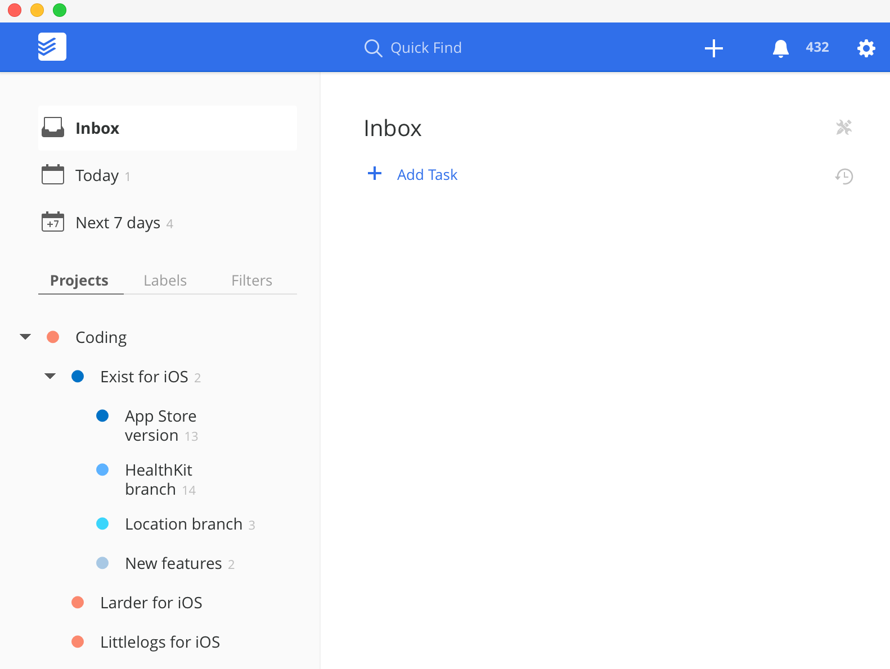

http://blog.bellebcooper.com/todoist.html

My project tree looks like this:

    Coding
        Exist for iOS
            App Store version
            HealthKit branch
            Location branch
            New features
        Littlelogs for iOS
        ToRead
        Journal
        Notes app
        Larder for iOS
        Project ideas
    Personal
        Calendar
        Bills
        Shopping
        Goals
    Hello Code
        Content
        Exist
        Littlelogs
        Larder
    Writing
        Topics
        Field Trip
        Productive Habits course
        BBC blog
    Clients
        Client 1
        Client 2
        etc.

    