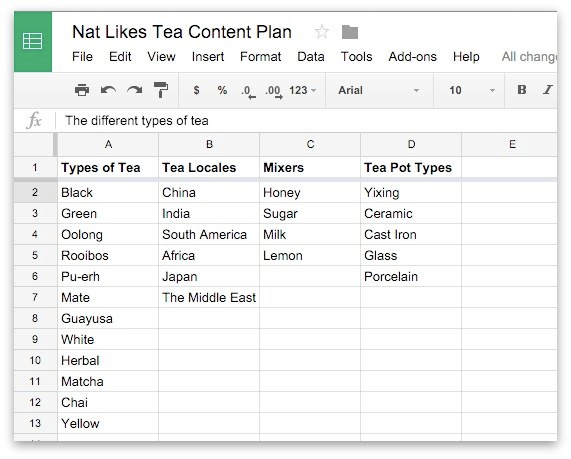
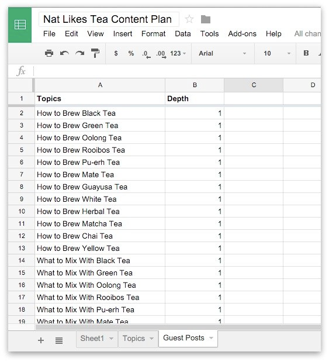
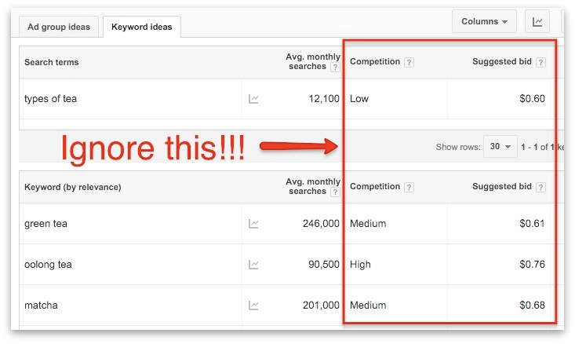

https://sumo.com/stories/0-10k-nat-eliason

---

## Step 1: Pick the Topic

(Skip this section if you already have your site built)

## Step 2: Create an Initial Article List

With the topic in mind, I’d come up with an initial list of articles that I could write, and keep them all in a spreadsheet.

[Get that spreadsheet here!](https://docs.google.com/spreadsheets/d/1bXks3WZg-xz-mtnsvDbkA9E6rjuCUSCJlLWepU-QpXg/edit?sumo_email_id=babf6fce-6a43-485b-8ce5-4ff31dc64e55#gid=919528249)

By doing this, I can make sure that I’m writing about the best topics to go after, not just picking things willy-nilly. The first couple ideas I have might be fine, but by spending some time to put all the options out there I can be sure that I’m spending my time as effectively as possible.

The easiest way to make this list is to come up with a few article styles, then mix and match styles and content to build a huge list.

Then just combine.

## Step 3: Prioritize Your Articles

Now that we have all of our possible topics, we need to figure out which ones it makes sense to focus on for our site (in order to get that sweet sweet SEO traffic), and which ones are fine to give to other people as guest posts.

To do that, we’re going to rank our posts by Depth, then SEO value.

### Ranking by Depth

I’m going to go through and assign a score of 1 to 3 for depth to each topic on the list:

1: Shorter, fun, one-off post. Probably < 1,000 words
2: Somewhere in the middle, 1,000-2,000 word guides
3: Massively useful in-depth guide on a topic, likely 2,000+ words

Then, take all the posts you ranked a “1” and put them in another Worksheet labeled “Later Posts”:

### Compare SEO Value

With the 2s and 3s, we’re going to figure out how valuable they are from an SEO perspective. This means assessing how many visitors we could potentially get to them from Google as a result of people searching for those topics.

First, go to Google Keyword Planner.

Then, take a topic you came up with, and plug it in as you have it:

> Can probably try to use Ahrefs when I get this list going.

plug some variations into that search bar at the top until we find a keyword (it’s a keyword even if there are multiple words) with a high volume

Now I just take that Keyword and the Keyword Volume, and add it to our spreadsheet

### Disqualify Tough Competition

This does NOT mean to look at the competitiveness rating in Keyword Planner.

What I mean by competitiveness is who else is ranking for this keyword in Google right now.

All I have to do is take each keyword, plug it into Google, and see what comes up. I’ll also use the Moz Toolbar to tell me how highly ranked the pages are.

If there’s a few major sites competing on a keyword, I’ll highlight it in red, but if it looks like smaller sites that I can definitely compete against then I’ll move on.

## Step 4: Pick Your Top 5-10 Topics

With your list of topics (excluding the ones that seem too competitive), it’s time to pick the 5-10 that you’ll put on your site.

With just 5-10 articles, you can easily reach 10k visitors a month. I currently get ~2,500 visitors per day from just 4 of my articles, so if just one of your articles reaches that level then you’ll have hit the goal.

## Step 5: Make a Schedule

Before you start writing, create a schedule in Google Calendar for how often you’ll publish, both on your site and other sites.

Aim for a minimum of two posts per month on your site, and one post a week on other sites. If you want to post more, put more time into posting on other sites. That’ll have a bigger ROI for you in the short term.

But the most important thing is that once you make the schedule… stick to it. Lock it in, and make sure that you’re getting your articles out when you say you will. That’s the only way you succeed at this.

## Step 6: Create a List of Similar Blogs for Guest Posting

You need a list of blogs that you can guest post on, and that you want to link back to you. The reason we’re doing this now is that once you have your list, you can include links to other people’s sites in your articles to earn good karma with them.

And ideally, you’re doing this over separate emails (so one that says “hey I linked to you” then a follow up later asking about guest posting), which means that in your first communication you’re not asking for anything, just making their life better

Add a worksheet like this one to your content plan:

And fill it in with the blogs in a similar niche as you.

## Step 7: Write The First Article

While writing it, I’d follow the guidelines for creating epic content that I give to writers for the Sumo blog:

* It must be actionable. Someone should be able to take the post and do something, not just go “oh that’s nice.”
* Focus on ONE core idea. Think of someone searching in Google. What question are they looking for the answer to, and why is your answer the best.
* Think of how you can make it the only article they need on the subject. When someone finds it they should go “whoa I better save this.”
* For length, think 1,500 - 4,000 words. More is fine if it’s kickass (this article is ~5,000). I find it’s hard to do a worthwhile topic justice with anything shorter.
* Use pictures. Make sure the pictures enhance the explanations--some fun photos are fine, but the point of the pictures should be to make whatever you’re saying more clear. No random stock photos.
* Chunk it up. It shouldn’t read like a New Yorker article. There should be helpful headings, sub headings, short paragraphs, bold text, etc.
* Links links links. Include any relevant links in your article. More links = more people we can email about plugging them in order to get them to share it.
* Link to my other articles. I can’t do this in the first one obviously, but for every article after that, this is important for SEO and for keeping people in the site

As for targeting the article to the keyword you’re going for, don’t worry about that too much. The only thing to make sure of is that you put the keyword in the title. Aside from that, as long as the article is about the topic you’re going for, you should be fine.

## Step 8: Create a Content Upgrade

Before promoting the article, I’d make sure that it’s setup to capture as many email addresses as possible.

The best way to do this is through content upgrades. A content upgrade is any bonus piece of content that builds on what they’re getting for free, and is worth giving up their email address for.

In this case, since the topic is different kinds of tea, I’d put together a 1-page PDF comparing their main differences of each kind of tea with nice visuals, and offer that to the readers, using the “10-minute content upgrades” method.

I’d put it in three places (for an example of this combo, check out my fasting article):

* A page-specific Welcome Mat. Instead of a site-wide Welcome Mat, I’d make one for that article specifically like I did on our Kickstarter Fundraising. This catches people’s attention right when they show up to give them the first offer.
* A page-specific Scroll Box. Just like the Welcome Mat, I’d make a page-specific scroll box that offers the same thing as the Mat. Why the same thing? Because people who didn’t opt in on the Mat might want an opportunity later.
* A click-triggered List Builder Popup. Last, I’d have a call to action at the end of the article that triggers a List Builder popup to give them another chance to sign up for the bonus.

## Step 9: Promote Your Article

### 1. Email Your List

I know you haven’t built a list yet, but secretly, you already have one.

Huh?

It’s all your friends.

### 2. Post to Social

I assume you have some Facebook friends.

Post the article to Facebook, tag some people you think would be interested, and see what happens. You’d be surprised by how many of your friends might be interested in what you have to say.

The same goes for Twitter, LinkedIn, and any other network you frequent.

### 3. Growth Hack Reddit

Eddy wrote a great [guide](https://sumo.com/stories/growth-hacking-reddit) on getting tons of traffic from reddit, but the simple version is:

* Find a few subreddits that allow “link” posts
* Post your link there
* Ask a few friends to give you initial upvotes

### 4. Email Everyone You Mentioned

Just say “hey I mentioned and linked to you in this post, here’s the link, have a good day.”

### 5. Submit to Other Relevant Communities

if there’s a good one that you can submit your links to and not worry too much about engaging with then go for it.

### 6. Submit to Quuu

If you join the site Quuu, you can submit links to different categories that are then shared by other Quuu users trying to fill their social media feeds.

## Step 10. Create a List of Guest Topics

Add a “Guest posts” worksheet, and come up with as many sub-articles as you can based on the one you just published. Add a column for “base” post, where you’ll list the post that you’re getting the ideas from, to remind you what to link back to when writing.

This is the best and easiest way to come up with guest posting topics. You ensure that:

* They’ll be fast to write since you’ve already sort of written them.
* You have an excuse to link back to the article you just wrote.

The whole point of guest posting (for this strategy) is to build links back to yourself and increase your SEO ranking, so you want to write about things that let you easily link to yourself.

With this strategy, you make sure that you’re giving people new content, while keeping it easy for you to make, and while helping your SEO.

## Step 11. Start Guest Posting

When writing the guest posts, make sure you do these things:

* Write really good articles. They shouldn’t be as good as the ones on your site (yeah yeah, I know, everyone else says the opposite, but they’re just saying that so you’ll give them your best content), but they should still be really good.
* Link to yourself tactfully. The point of the guest posts is to build more links back to yourself, so add in a few tactfully. No one wants a guest post with a dozen links that all go back to the author’s site, but no one will complain if you have a few.
* Get it to them ahead of schedule. As someone who manages a blog with a lot of guest posts, being early makes the editor love you forever. Most guest posters are flaky, get things in at the last minute, and make managing a blog a huge pain in the ass, so DON’T BE THAT GUY (or gal).
* Promote it. When you get published on another niche site (don’t worry about promoting it if it’s on Elite Daily, Huffington, etc.), promote it! They might not have a huge amount of traffic yet either so if you can get them some love they’ll want you to come back.

## Bonus Step 1: Re-Target Your Old Posts

You might have originally been going for one keyword, but then you start to get picked up for another tangential one.

When that happens, update the title of your post to fit that new keyword (assuming the volume is higher).

## Bonus Step 2: Make an Email Course

In the case of Programming for Marketers, I have a site-wide email signup rate of ~15%, just using Welcome Mats and List Builders in all of our articles (in addition to the landing page).

The easiest way to do this is just wait till you have ~5 great articles on your site under a certain theme, then package them into an autoresponder in MailChimp or another email marketing tool, and tell your visitors that they can (in this case) “Sign up to get 5 free lessons on become a tea master” or something similar.
    