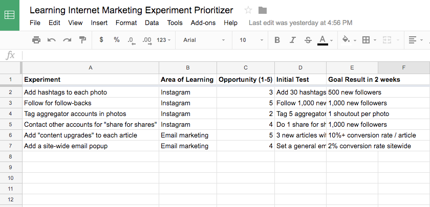

https://www.nateliason.com/blog/learn-digital-marketing

---

I’d expect that anyone could take a gameplan like this and go from **zero to hireable digital marketer in 6 months** or less, **so long as you work hard at it and don’t get too distracted**.

## Step 1: Pick Your Initial Focus (10 minutes)

Digital marketing comprises all the strategies you have available to try to get people to a website, get them to return, and get them to take an action.

We can call these three phases Acquisition, Retention, and Conversion.

When starting out, focus on being a generalist. You won’t know what you’re most interested in yet, so building up a general digital marketing skill set will help you hone in on the areas that excite you most. You’ll also be more hireable since a digital marketer who can wear a few different hats is much more useful than one who only knows how to do Instagram ads.

### My Stack
1. Acquisition
Search Engine Optimization
Affiliate Marketing

2. Retention
Community Building
Email Marketing

3. Conversion
Copywriting
Landing Page Design

## Step 2: Build Your Sandbox (1-7 days)

As for what should your sandbox be, you have a few options. The easiest is to start a blog.

If you do decide to go with a blog though, please, for all of our sakes, do not start a marketing blog.

Instead, write about something else you’re interested in. Some hobby you want to get better at, or some area of interest to you like psychology or history.

> Perhaps use David Perell's [Personal Monopoly Worksheet](./resources/42b7e56298f14dc3835239dca29dbc1e.pdf) to determine what you should write about.

As I mentioned in my Wiki Strategy article, it helps to be very focused in your growth channels, so if you said “social media” before, try picking just one social media channel to put most of your focus on.

You can always expand your channels later, but if you try to do everything at once in the beginning, you’ll burn yourself out.

## Step 3: Initial Practice (2 weeks)

The Bullseye Framework is an excellent tool for finding certain channels to try for your product, but it’s also useful for running experiments within a certain channel. For now, you want to stay focused on your stack, so you can use the Bullseye Framework to run certain experiments within those skills.



Don’t try to improvise right now, you’re still a novice, and following someone else’s plan will be extremely helpful.

## Step 4: Research and Iterate (2 months / till you die)

Your process at this stage should be:

1. Run a few marketing experiments (usually for ~1-2 weeks)
2. If an experiment succeeds, turn it into a system and keep doing it
3. If one fails, find another one to run

What you must be careful to avoid is spending all your time reading and thinking up new experiments and not spending enough of your time implementing and testing them. Many of these experiments will require iteration and patience, and it’ll be tempting to look around for quick wins instead. You’ll have to avoid that temptation and stick to the plan if you want to learn.

## Step 5: Freelancing

When you’re trying to help another company or person do what you’ve done on your own, it’ll expose areas that you aren’t as familiar with, and can help you round out your understanding of the skill. And if you’re able to find someone you can freelance for who’s more skilled than you are, they can point out areas for you to improve that you might have missed on your own.

## Step 6: Keep Expanding, Keep Experimenting


## All Traction Channels

Within **Acquisition**, you have:
```
    Search Engine Optimization
    Search Engine Marketing
    Advertising
    Social Media
    Affiliate Marketing
    Influencer Marketing
    Viral Marketing
    Publicity
    Communities
    Other Platforms
```

Within **Retention**, you have:
```
    Email Marketing
    Social Media
    Community Building
    Notifications
    Retargeting
```

And within **Conversion**, you have:
```
    Copywriting
    Landing Page Design
    Sales
    Email Marketing
    Retargeting
```
    