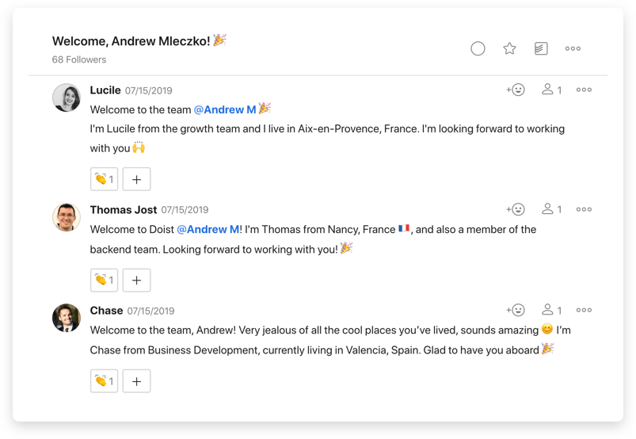

Great article, can be easily re-read.
https://doist.com/blog/remote-onboarding/

---

## Introducing New Team Members

Before your new report begins, ask them for a short bio about themselves which you can use to introduce them. Ask them for information on the following:

* A few details about themselves (e.g. location, hobbies)
* Where they worked before
* What skills they’ll bring to the team
* What they’re looking forward to about starting their new role
A profile photo

---

## Making a Good First Day Impression

We start a welcome thread in Teams for each new member that joins our team with the title “Welcome, [Full Name]!”

The first post of this thread is often written by their manager or our People Operations Specialist (could be Alan in our case) and includes information from the bio they provided, what they’ll do at Guy Carpenter, and encourages everyone to give them a warm welcome. People respond with their name, where they’re working from, and what team they’re on.

Encourage their team members to message them.

---

## Providing a New Hire Checklist

Onboarding task lists should be department specific and modified slightly for each person

Foundation:
* Register for Asana
* Request Access to our services (email, vpn, devops, databricks, etc.)

Role specific:
* Set up meeting to get introduced to the code base

A new hire checklist is simply a starting point.

---

## Pairing Them With a Mentor

A good practice for remote onboarding is pairing new team members them with a mentor. This shouldn’t be direct manager, but someone senior on their team.

> Since Manrique is senior and we are all pretty new, this might not be needed

A mentor is a trusted guide to help new team members navigate an unfamiliar environment and feel less isolated on a remote team.

---

## Extending Responsibilities

Once your latest team member has completed a few new hire tasks, it’s time to extend true responsibility. Give them a small project that is low-pressure but allows them to use their expertise and problem solving skills.

> Again, I think since we are a new department and there are tons of things to do, this might be unnesseccary and we can jump straight into action.

For the project:
* Provide the context of the project.
* Set expectations
* Give them points of contact

## Checking In Regularly

Stay in close communication with new employees and regularly initiate conversations with them.

> I think that due to the Coronavirus outbreak we all need to communicate a little more than usual, simply for the reason that some may feel lonelier than usual.

This serves multiple purposes:

 1. Establishing they can reach out to you whenever necessary
 2. Reducing the feeling of loneliness and isolation
 Building a rapport

---

## Asking for Feedback

During and after their remote onboarding process, request feedback so you can ultimately course correct or improve the process for the future.

Here are a few questions to ask to understand their experience:

* How did your first few weeks here compare to your experience at other companies?
* What could we have done better to make your transition easier?
* What parts of the onboarding process helped you understand our team better?
* So far, is this job what you expected? If not, what could we have done to communicate the role better?
* Is there anything I can do to better support you?

Don’t ask new team members all these questions at once. Instead, ask one or two questions intermittently throughout their first few weeks, or even months, on the job.

    