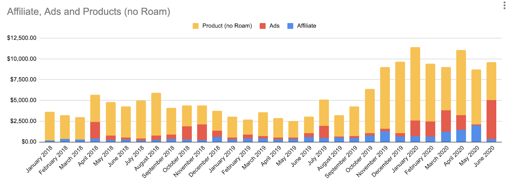

07/23/2020

https://www.nateliason.com/blog/start-a-blog

Below is the list of things that jumped at me the first time I was reading this piece. However, I encourage to read the whole thing. It is fascinating, and is full of useful and actionable advice.

---

> Way too many people obsess over launching with a perfect site and never go live. 

Yep, I can certainly relate to that. I did go live multiple times, but I spent hours and hours making sure each pixel looks good. It was a total waste of time, since you won't be ever fully satisfied with the design. I changed it up at least 5 time.

One upside, I learnt a good portion of HTML and CSS. 

---

> Get over the fear and put yourself out there.

---

## What to Write About

> That's a combination of good SEO, and good curation. People don't want to read 10 articles or 30 guides. They want one great resource. Your job is to create a great resource for whatever you're writing about.

## Finding Topics to Write About

> If you write an "I believe" post and you don't piss some people off, you're not doing it right.

---

## Surge Traffic

> Reddit has so many people on it, and there are communities for everything. Whenever I published a post I thought would do well there, I would find a community I could share it in, post it, and see what happened.

Most of the time, it didn't work. It wouldn't catch on and wouldn't drive any significant visitors. But sometimes it did, and it would work in a big way.

---

> So what's the secret to getting a big spike of traffic from reddit? Unfortunately it's a fairly dull strategy: write a great article, find a good community to share it in, post it, maybe cheat a little bit by having 3-4 extra reddit accounts upvote it, and cross your fingers. It won't work most of the time, but when it does, it can be a game changer.

---

## Evergreen traffic

> you don't want to waste your time by producing pieces that are only valuable for a few days.

---

## Audience Traffic

> This is the ultimate goal for any blog. You want to build up a base of people who love what you write, and who will consider reading anything new you put out. It's where the true value of the blog comes in, because it means you're on people's minds for certain kinds of opportunities or questions they might encounter.

It didn't take long to convert me into such person. I think after reading 2-3 posts I was hooked on Nat's writing.

---

## Monetization and Spotting Opportunities

> If we remove the Roam Course, here's what my revenue for this site looks like since 2018.

---

## Affiliate Sales

> For this site, the affiliate income has been nice, but it's not massive, and not something I intend to optimize around. Treat affiliate income for a personal site as bonus money.

    