https://medium.com/@foundercollective/images-that-must-accompany-every-startup-pr-pitch-73f5f24ec3d

I’d recommend including *at least* one of these image types, ideally, all four:

🦸‍♂️ The Hero Shot
Hopefully, you have a product that looks cool. Minimally, you’ll have a clean image that explains your product’s value proposition. Pictures *are* worth a thousand words — invest in them

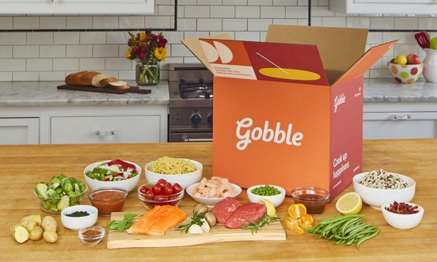
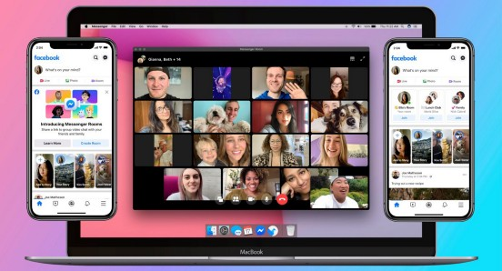

🏙️ The Office Logo
A reasonable alternative to the “hero shot” is a photo of the founders against the backdrop of a semi-artful logo in your startup’s well-lit lobby. Even a photo of the logo in your office can be a decent option.

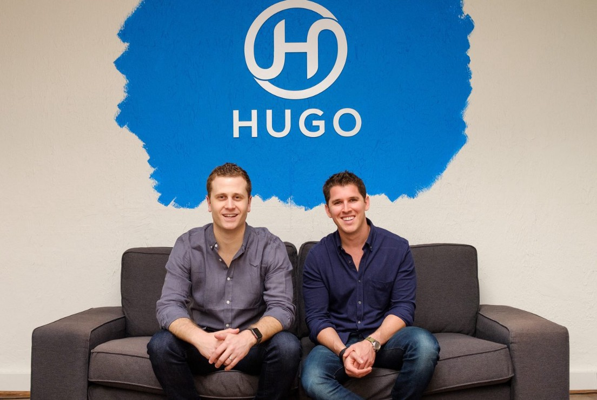
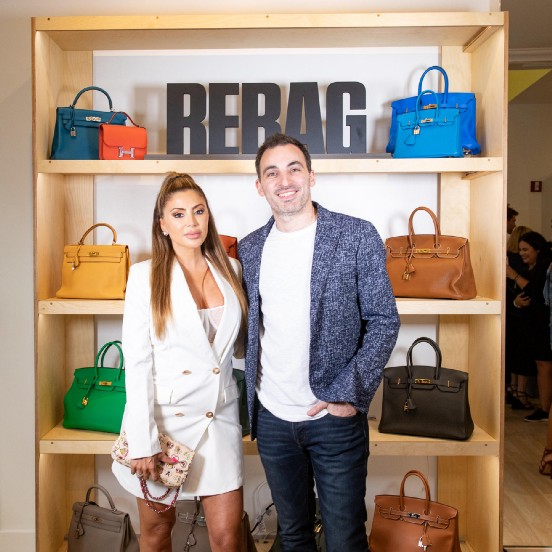

🦁 The Logo in the Wild
A photo of your logo out in the world is a powerful asset. The context clues help explain to potential readers what your startup does, and it demonstrates you’ve actually built something.

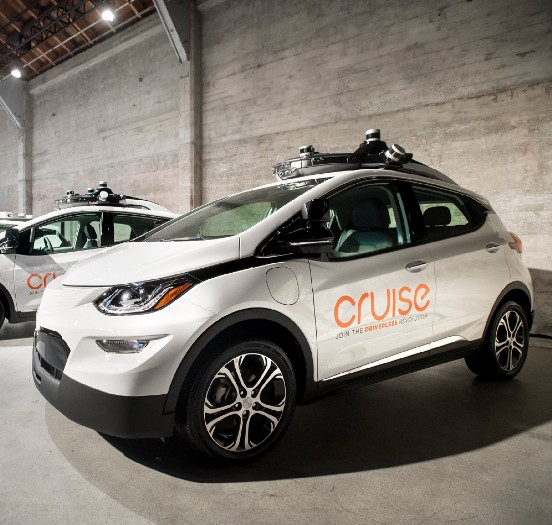
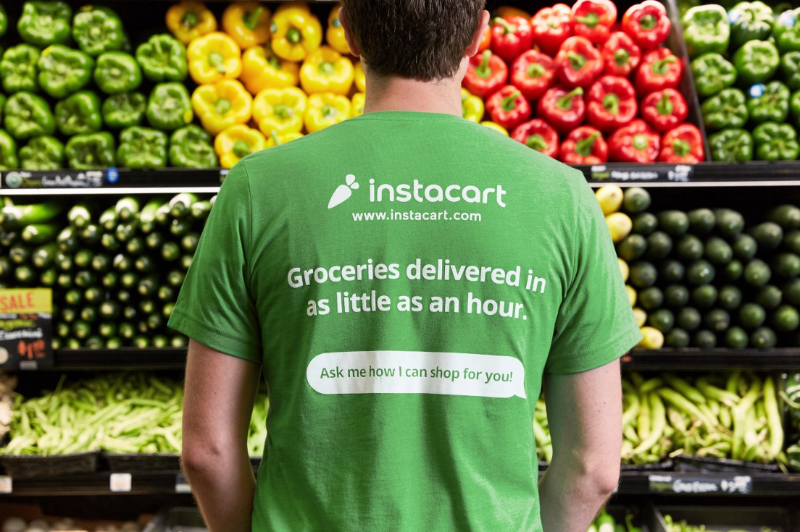

🎨 The Illustrated Logo
If you don’t have the time/budget to make rich visual assets, at least ensure that you prep a high-resolution version of your logo.
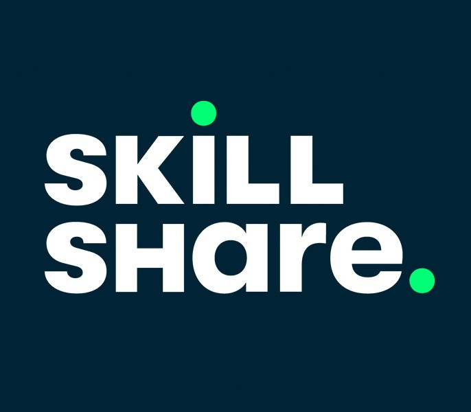
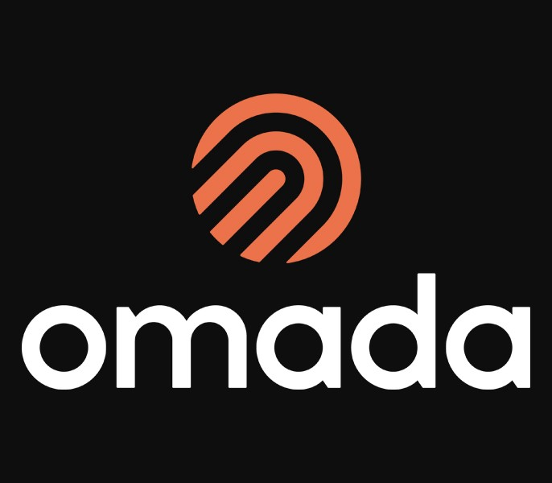

Another easy option is to put your logo over a piece of stock art that provides some context. Get a free image from Unsplash, add a couple of adjustment layers in Photoshop, and you’ve got a decent press image. 

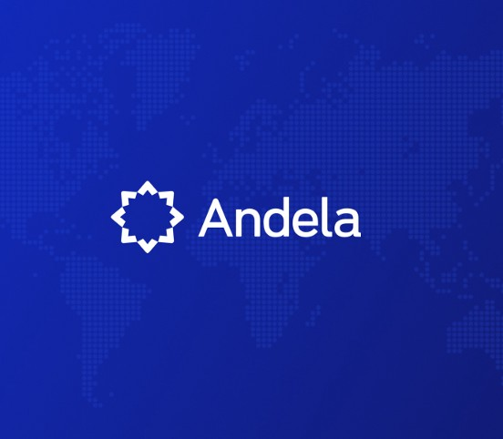

💻 Logo on a screen
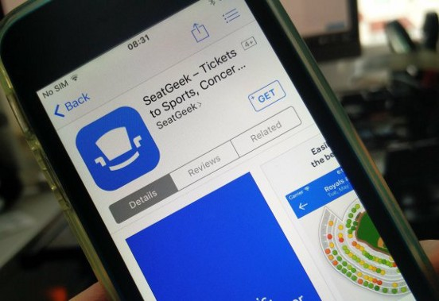
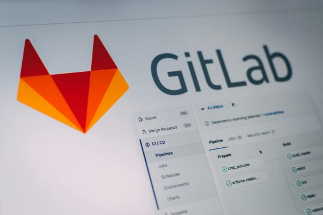

🎭 Logo on a stage

Your logo presented on a large screen at a conference is a decent option for businesses with ephemeral offerings. Like the logo in the wild, it suggests that *someone* thinks you are important enough to put on stage. 

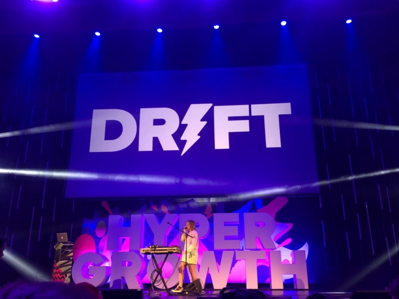

✏️ Logos with Illustrations

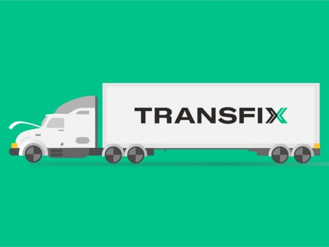

📣 Mascots
If your product is dull, but you’ve got a playful spirit, it’s an underutilized way to build affinity and recognition.
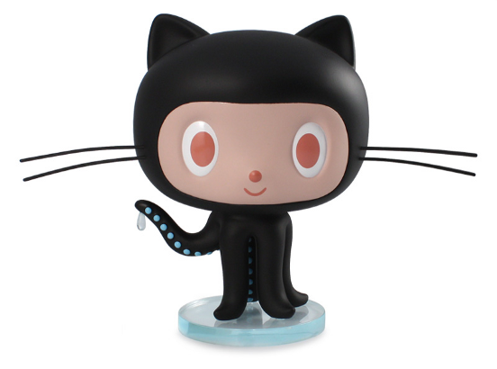
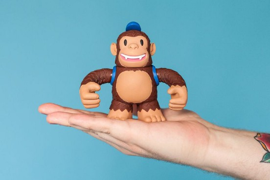

* Avoid stock art sterility at all costs!
* If you want PR, invest in design

    