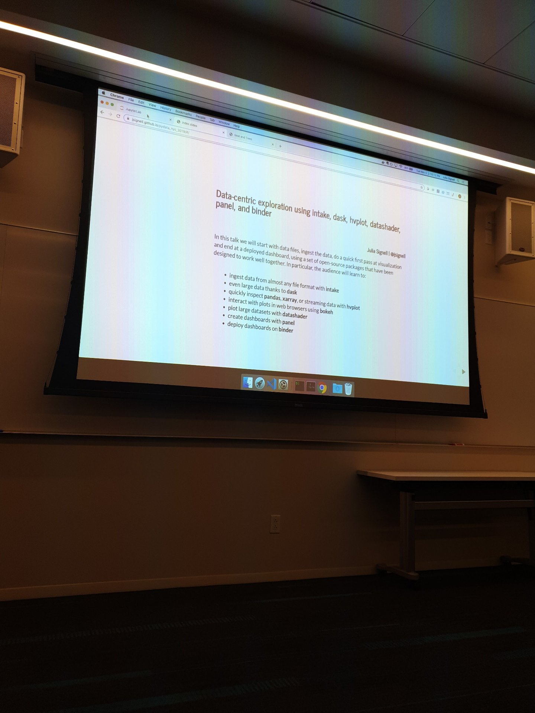
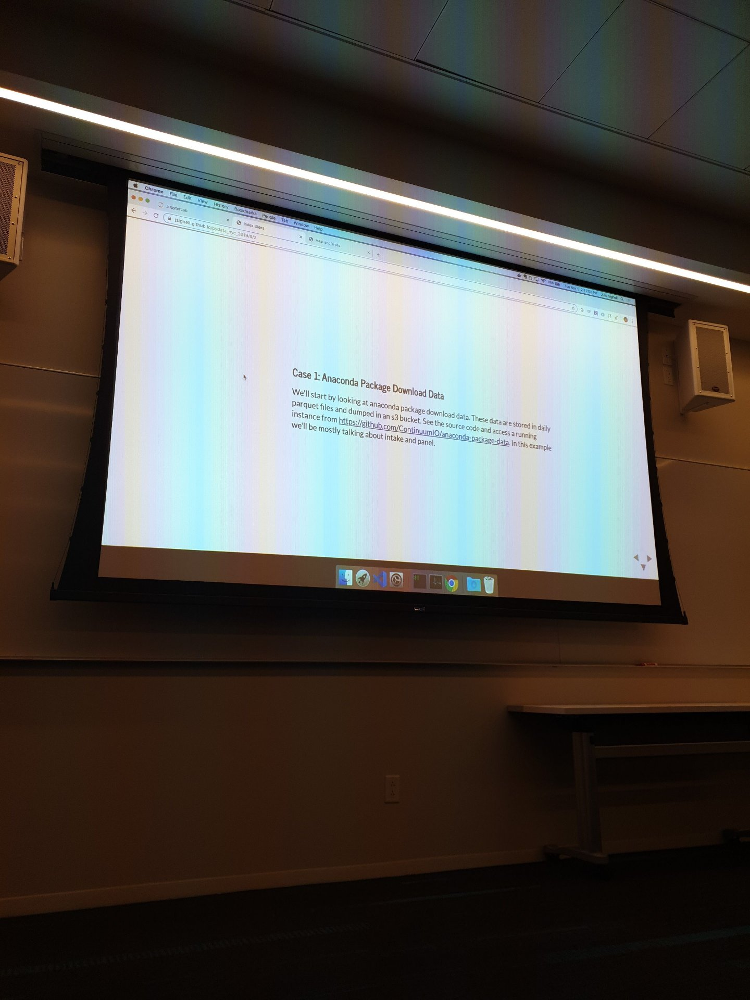

# A Crash Course in Applied Linear Algebra
Patrick Landreman @spry

# Meghan Heintz at Rent the Runway

# Same API, Different Execution
## Saul Shanabrook @quantsight
* Numba
* Scikit-image 
^ checkout

# Spark Backend for Ibis: Seamless Transition Between Pandas and Spark
## Li Jin, Hyonjee Joo
Ibis syntax/API similar to SQL

# Every ML Model Deserves To Be A Full Micro-service
## Romain Cledat @netflix (mlinfra on a shirt)
* Kibana for logs
* Server gunicorn flask
* Storage s3
* What is Spinnaker
* Metaflow code 
* Openfaas for implementation
* Hiring rcledat@netflix.com

# Clean Machine Learning Code: Practical Software Engineering Principles for ML Craftsmanship

## Moussa Taifi Ph.D. @Xandr 
* Knight Capital example of bad decision making 
* Loose coupling is making component not depend on each other 
* High cohesion - 

# jupyter notebook workshop 

# Data-centric exploration using intake, dask, hvplot, datashader, panel, and binder
## Julia Signell @Anaconda

# Introduction to NLP
## Mariel Frank

# Swiftly turn Jupyter notebooks into pretty web apps
## Michal Mucha - Create.ml - @jeremimucha

    