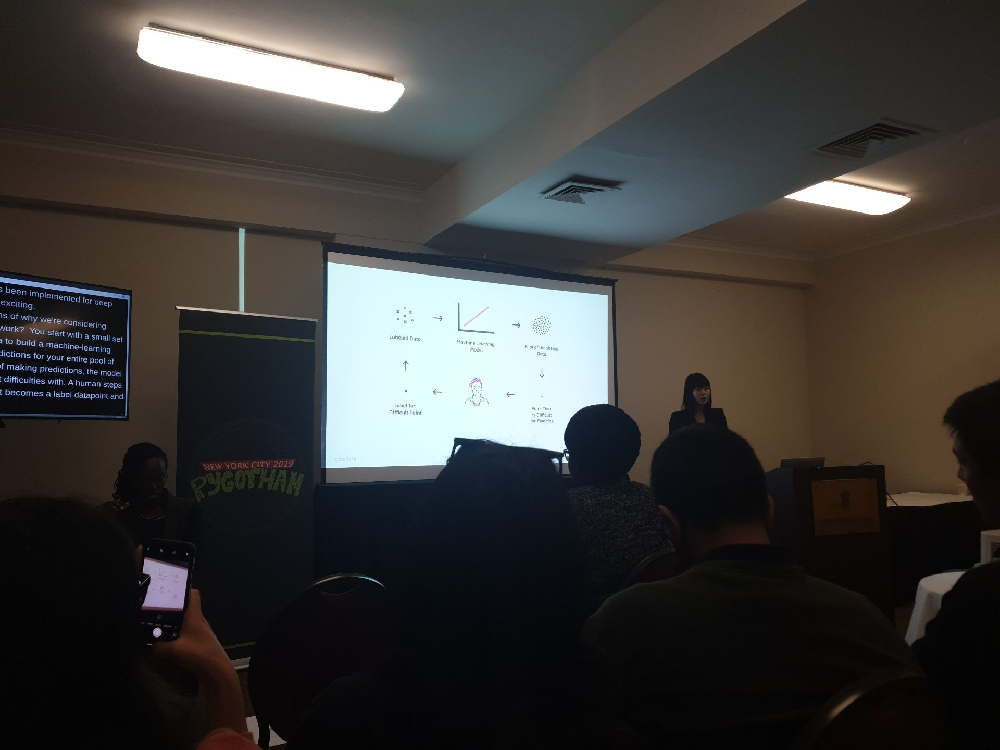
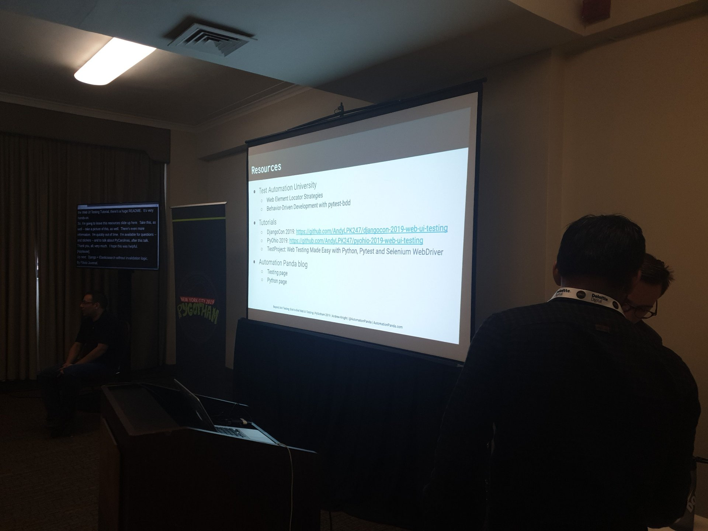

# Python use spectrum
## Kojo Idrissa
More speakers always needed.
Volunteers always needed
Defna.org - django organization


# Eita! Why internalization and localization matter
## Nicolle Cysneiros @Labcodes (py + django + js)
## Differences
*Date Formats (mm/dd)
* Number Formats (123,123 vs 123.123)
* Currency, Bidirectional Text & Unicode Characters
## Python
* GNU `gettext`
  * Essentially creating a 'list' of text blocks that will need to be translated.
* `locale` module
  * helps change the formats of the above mentioned differences
* Apparently django makes it super easy. **Talk to presenter** (ask about datetime, it didn't reference the `locale` module.


# The promised Django Land; the tale of one team’s epic journey from the country of Flask to Django Land
## Nicole Zuckerman @Clover Health
* **Left**
*   the story as a fairytale with Marvel characters
* Hard to follow, not relevant, not many learning points, too high level


# Can you keep a secret ?
## Aaron Bassett @Nexmo
* Git-secret.io
  * Uses pgp


# Absolutely Awesome Automated APIs
## Timothy Allen - WRDS (uses Django)
### -@flipperpa -tim@pyphilly.org -djangonaut -hockey_fan_flyers -guitarist -loves_icecream
* Automagic-Rest - open source
* Drf renderer xlsx - open source library to convert API endpoint to excel file


# Recreating "The Clock" with Machine Learning and Web Scraping
## Kirk Kaiser @datadog
* Tate modern - the clock
* To start:
  * Simplify
    * try kubernetes locally - Ubuntu + Nvidia, ngc.nvidia.com
* Dab & t-pose controlling light
* Jetson nano gpu accelerated machine 99$
* Datadog is hiring


# To comment or not? A data-driven look at attitudes toward code comments
## Veronica Hanus
* Funny good presenter
* Comments are good , leave them
  * Thats the general consensus


# Learning with Limited Labeled Data
## Shioulin Sam @cloudera
* Very clear and great presenter
* **Active learning** has been here for a while , bit only now got integrated with ...

* Random sample data points to label (good, but not optimal)
* Margin Sampling
* Activelearner.fastforwardlabs.com
* Twinkl and Ai podcast


# Introduction to Generative Adversarial Networks (GANs): hands-on to making new data (and some pretty pictures)
## Nabeel Seedat
* Goodfellow (link)
* Dirpfakes (link)
* Deep Convolutional GAN
* Fashion mnist
* Gan zoo


# What physics can teach us about learning
## Marianne Hoogeveen
* Neutral network can approximate any smooth function - Universal approximation function
* Scales matter when it comes to identifying patterns (neural networks) - renormalization group i.e. compression

# Django + ElasticSearch without invalidation logic
## Flávio Juvenal @vinta
* Most popular search
* Why search engine
  * Tokenization
  * Fuzzy similarity
  * Cleaning
* Elastic search built ins
* Less than million rows of Data can be searched with postgres built-in capabilities (check Django postgres search ) if more than 1m than implement elastic search
* Haystack library for search in Django
* Zombodb works with postgres (via access method API) (Django-zombodb)
  * will Soon work with postgres 11

# Static Typing in Python
## Dustin Ingram @Google @di_codes
* type errors happen
  * When Python expects a list received a string and converts that to a list , ugly list
* Python originally is dynamically typed, but can also be static. Which is a great strength
* Pep 3107 fucntions
  * Def Foo() <- max(2,9)
  * Foo.__annotations
* Mypy from PhD introduced on pycon us 2013
  * Experimental variant of Python that is statically typed
  * After talking to Guido decided to implement to pure Python
* pep 483 theory of type hints
  * Optional typing (+gradual typing)
  * Variable annotation
* Check data science from scratch again , it has some static type instructions
* Pep 484 type hints
* Pip install mypy
* When not to use : never
* When to use : as much as possible (Start early)
  * When code is confusing
  * When for public consumption
  * Before big migrations and refactoring
* Start early
* Note : not a replacement for unit test


# Convincing an entire engineering org to use (and like) mypy
## Annie Cook  @nylas - hiring
* Mypy is a static typechecker , type of documention (self documenting )
```python
#pep 484type hints
Def Foo(type: str)  -> str
twitterLink: ""
hnLink: ""
redditLink: ""
indiehackersLink: ""
  Return
```
* With mypy linters work better
* Captures a large category of errors
* Union is a multiple type
* _learn x in y minutes_ . Saw some guy in the talk use this website, seemed interesting


# ministry of silly talks

## in-toto - securing the whole software supply chain
### nyu , njit, Santiago Torres Aria's, hammad afzali, etc.
* Not rely clear, probably hard to implement
* Sounds scary where people can attack software, need to check if that actually happens
* In-toto.io


## Test your failures with xfail
### Paul ganssle
* Decorate a test that you expect to fail with
 `@pytest.mark.xtest`

## experimental features in scikit learn
### thomas j fan - scikit learn core devoler
* Deprecations ?
* Use columntrasformer to transformer some of the dataframe

## Why your tech company from recruit from philosophy  department
### Katherine Hartling - @KatOnceSaid
* Jackpocket.com
* Plato's concept of classes

## greed an homage
### Julian @julian GitHub, @jukainwastaken on Twitter
* Algortim of change in supermarket, greedy algorithm
* when does it work
  * When you can take Independent choices within each step
  * Matroids ???

## change just one thing
### Timothy Allen , same guy as WRDS talk in API
* deaaled with alcohol addiction problem
* Ask help , people are willing to help , especially the Python and Django communities

## Damocles : how do we intend to solve it
### Anuj
* Tool for learning words in context
* Scrapes video (big bang theory) with the search word


## structured logging in Python
### Jonathan Meier software engineer @openslate
* structured logging is writing consistent logs that are easy for computers to read (JSON)
* Python-json-logger or structlog

## Restructuring Data in Python
### Mahmoud Hashemi @ sedimental.org
* Flat is good  vs namespaces are good Time Peter Pep20
* Nested data is bad
* Glom library - Python data nester
* Good presenter

## ministry of silly runtime: Vintage Python on cloud run
### Dustin Ingram @Google @di_codes
* Run stateless http container
* Docker images as a service
* Installed old Python (1.0.1) on  cloud run
* Good presenter


# Cool but didn't go.

## Building Docs Like Code: Continuous Integration for Documentation
### Mason Egger
* Not attending, but seems very interesting
* https://2019.pygotham.org/talks/building-docs-like-code-continuous-integration-for-documentation/
* Mason.dev

## Building effective Django queries with expressions


## Can Neural Networks Help Me Become a Better Parent?
### Vanessa Barreiros

## Beyond Unit Tests: End-to-End Web UI Testing
### Andrew Knight

