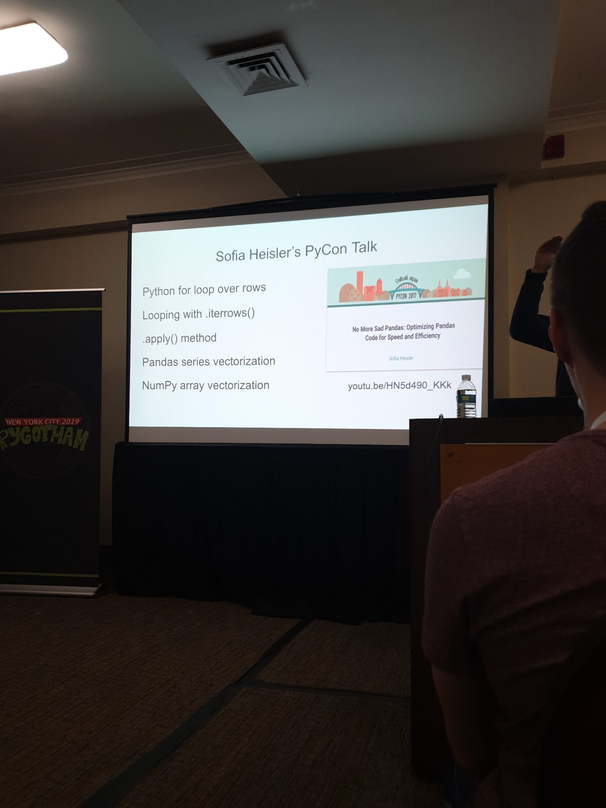
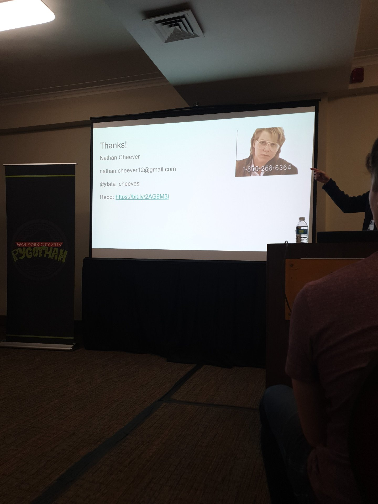
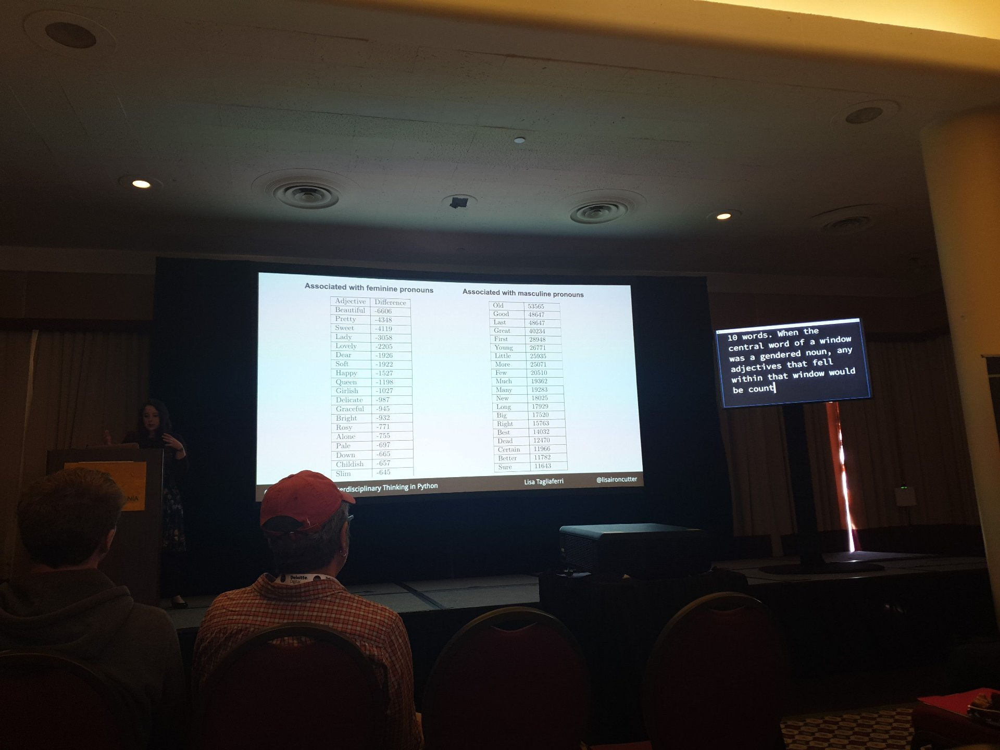
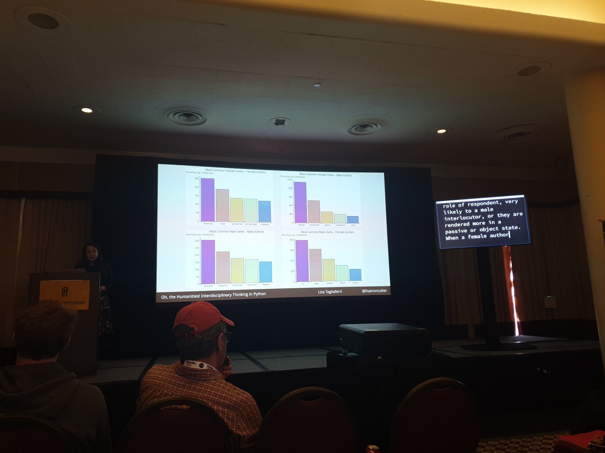
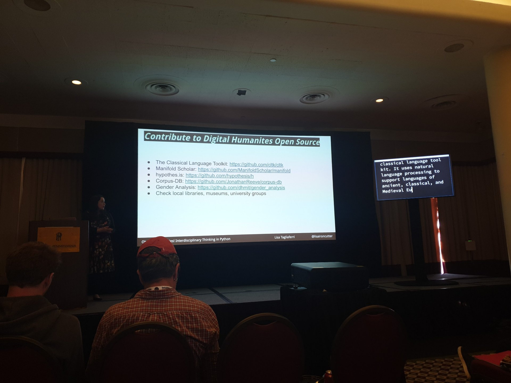
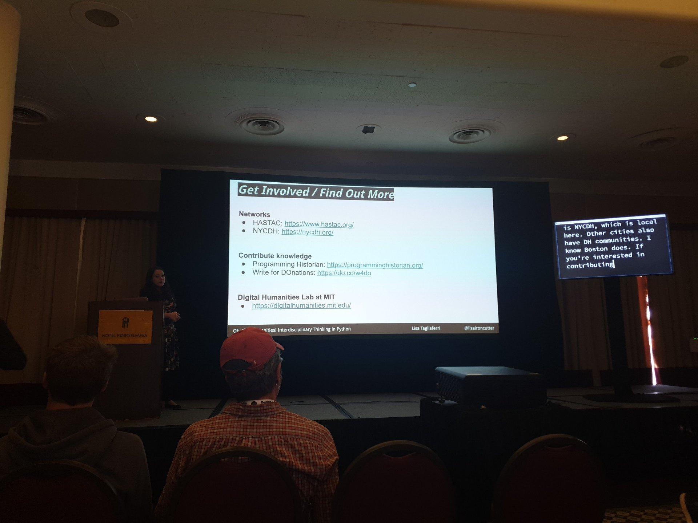

# Accepting your successes 
## Piper Thunstorm 

# 1000x faster data manipulation: vectorizing with Pandas and Numpy
## Nathan Cheever @AdvancedMD Ds
* For loop vs vectorization
* Vectorization working with array or series without for loops, rather all at once.
  * You are probably already doing that to some degree 

* To perform conditional vectorization do: **numpy.where()**
* Numpy.vectorize()
* Numpy.select() for multiple ifs / elifs
* Pd.shift() to create anoer plumn with values shofted
* talked about Dask 

* Kubernetes shirt

# Using Dash to Create Interactive Web Apps for Non Technical Audience
## Joseph Willi , Joseph.willi@ul.org @underwriters labarotory
### AZV Dashboard (Arizona Vortex)
* Apparently great company, mission oriented 
* Their job is to fire staff and gather data 
* Somehow connected physical devices such that the plotly days gathers data from the device and inputs it to the dashboard 
* What was the "noise" on the graph , when devices were static . ASK.

# Distributed Machine Learning with Python
## Brad Miro @google 
* Latest ml updates,: Gpu, Tensorflow unit 
* Kubeflow that marries Tensorflow and Kubernetes 

# Pull Requests: Merging good practices into your project
## Luca Bezerra - lucabezerra@gmail.com - vinta 
* Code review , even if unwanted adds greatly to the project 
* Best practices -
  * Pull request template.md on github
  * Status checks prevent branches merging without checks 
  * Contributing .md for collaboration 
  * Enforce approval/merge rules : codeowners.nd 
  * Using **gitflow** makes sure your branches are always up to date 
    * Branches are cheap and great flexibility 
  * Keep pr size as small as possible 
  * More clear commit messages (talk about what and how ), 1paragraph ~
  * Use linters when possible (learn on linters)
* Tips & tools 
  * Refined GitHub 
  * Deploy Previews (Netlify)
* Check Vinta checklist 

# Jane Doe will help you improve your project
## Rebecca Sarai - Vinta 
* Netflix prizes - challenge 
* Talk is about anonimization 
* Psedonymization - is personal data , but you hide the data in a particular manner , includes 
  * Tokenization, etc.
* Anonimization no data that considered personal and can be sued to identify a person 
  * Static 
  * Dynamic 
  * Synthetic 

# The Cat's Alive! Add Some Weirdness To Your Code With Quantum Computing
## Jorn Mossel works in finance, Marianne Hoogeveen
* Classical comijter works with 0 and 1 
* Qubit can be a bit of both (circular form)

# Oh, the Humanities! Interdisciplinary Thinking in Python
## Lisa Tagliaferri - Digital Ocean, wrote tutorials for
* Research on how women men are described in certain ages.
* TeXt from Gutenberg projects were analyzed 

* Very interesting 
* Text analysis might not be that scary after all. It never was , bit now it is certainly interesting enough to give it a try 
* Gender novels project 
* Caterina.io
* Hacktober fest

* Lisatagliaferri.org

# Serverless Deep Learning with Python
## Alizishaan Khatri @Kony Machine Learning Engineer 
* Kony builds applications for banks 
* Unfortunately I do not follow at all

# Airflow in Practice: How I Learned to Stop Worrying and Love DAGs
## Sarah Schattschneider - software engineer @ blue apron - hiring
* Airflow replaces from 
* One of advantages is the more advanced alerting system
* Goog cli and UI 
* open Sourced by Airbnb

# Because Equity: Python FTW
## Meg Ray

    