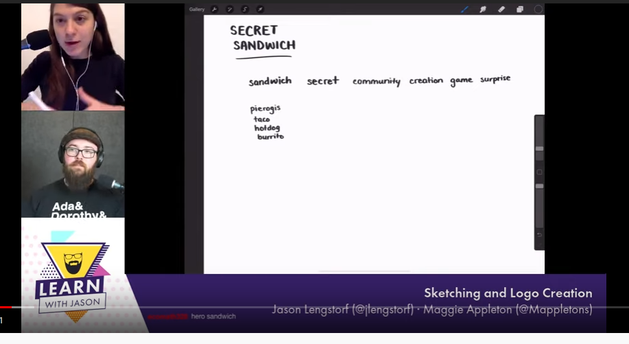

05/30/2020 10:04

https://www.youtube.com/watch?v=4mrrNAjiTvk

[Show Notes]
* Maggie uses Porcreate on iPad to do all the sketching.
* Drawing Help:  
	- Draw a Box – https://drawabox.com/  
	- How to Draw by Scott Robertson
	- https://www.reddit.com/r/ArtFundamentals

[8:38]
Comes up with two or three core themes that we are trying to communicate.

[11:50]
During this step try to apply "Yes and" type of thinking.

[13:25]
This step is where you come up with potential ideas. Based on your core themes get a long list of "keywords" that apply to those themes.

[25:21]
Maggie uses these word-nerd tools when she get stuck on the word association step. Language Exploration Tools:  
- OneLook Thesaurus – https://www.onelook.com/thesaurus/
- iWeb Corpus Search – https://www.english-corpora.org/iweb/
- Wordnik - https://www.wordnik.com/  
- Etymology Dictionary – https://www.etymonline.com/

[32:53]
Now the next step is making connections between the words. That is where SCAMPER comes in.

From [Wikipedia - SCAMPER](https://en.wikipedia.org/wiki/S.C.A.M.P.E.R)
> SCAMPER is an acronym that provides a structured way of assisting students to think out of the box and enhance their knowledge.
It is thought to protect students' creativity as they mature.

> SCAMPER is an activity-based thinking process that can be performed by Cooperative learning. Here the teacher assists the students in choosing a particular topic and helps them to develop it through a structured process. After choosing an idea, the students are given a tale where they perform the activity in steps corresponding to the letters in the name. 

> * *Substitute* comes up with another topic that is equivalent to the present topics.

In our context how can we subsutute a part of the item from one listen with the item in another.

> * *Combine* adds information to the original topic.

> * *Adjust* identifies ways to construct the topic in a more flexible and adjusted material.

> * *Modify, magnify, minify* creatively changes the topic or makes a feature/idea bigger or smaller.

> * *Put* to other uses identifies the possible scenarios and situations where this topic can be used.

> * *Eliminate* removes ideas or elements from the topic that are not valuable.

> * *Reverse*, rearrange evolves a new concept from the original concept.

[34:00]
> Everything is a box. Learn to draw boxes and you can draw many things

Same with circles, right. So if you can draw circles and boxes you must be a drawing god!

After doing a light sketch Maggie erases the sketch with a light eraser and draws on top of the "shadow" that is left.

    