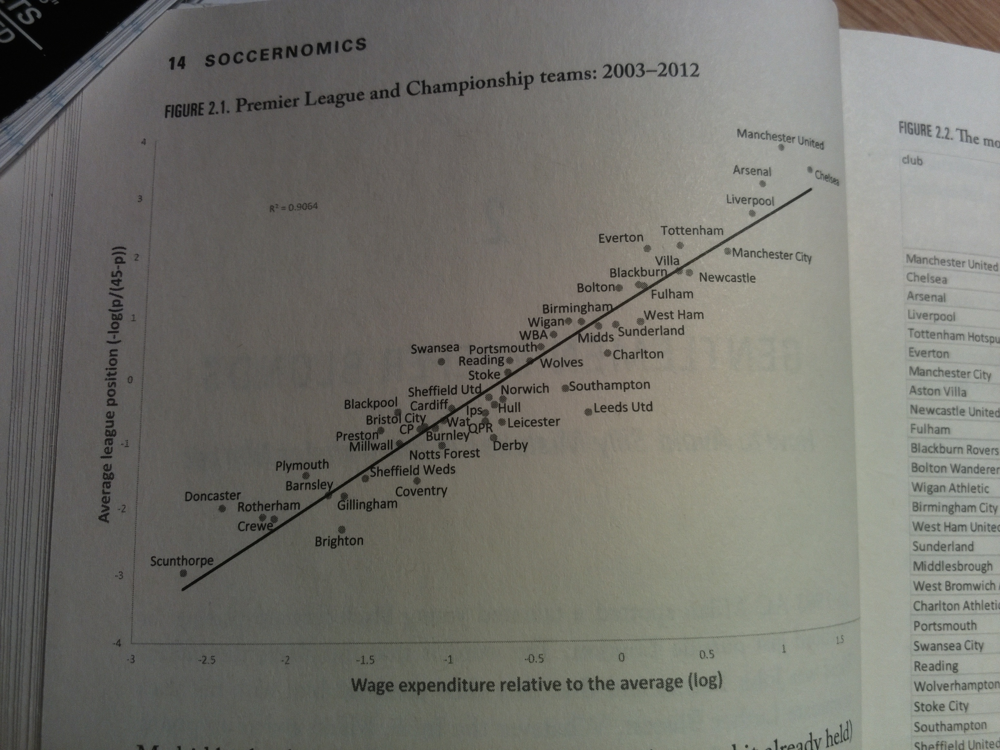
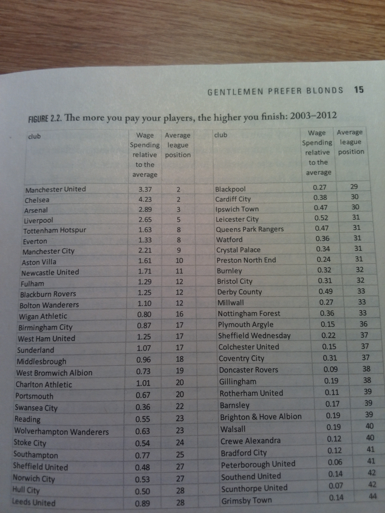
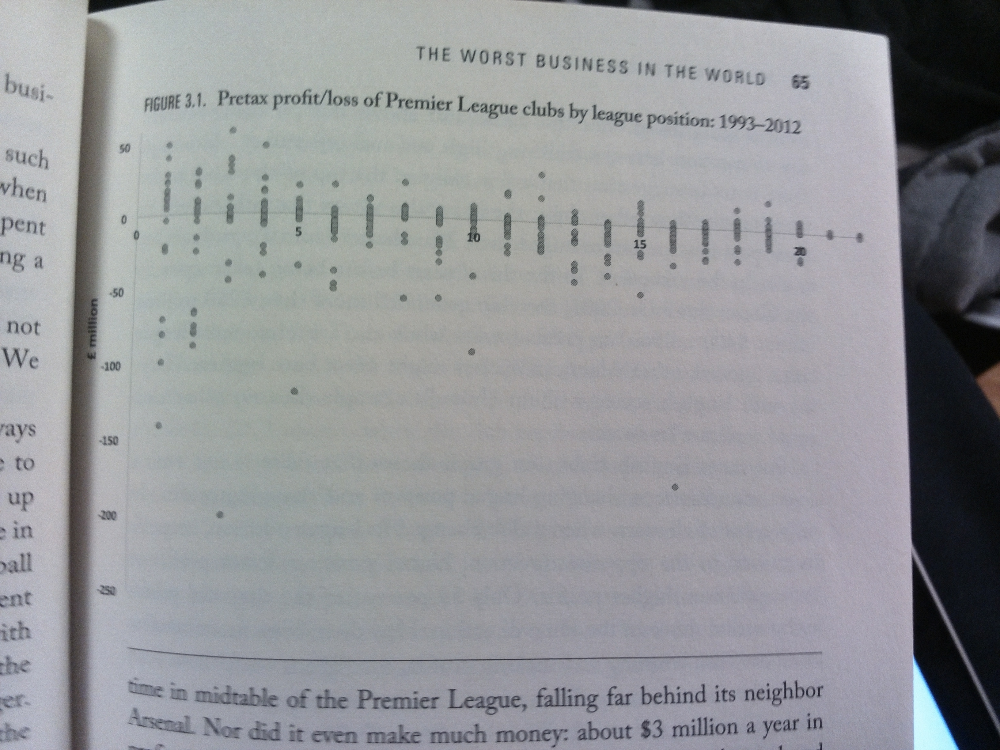
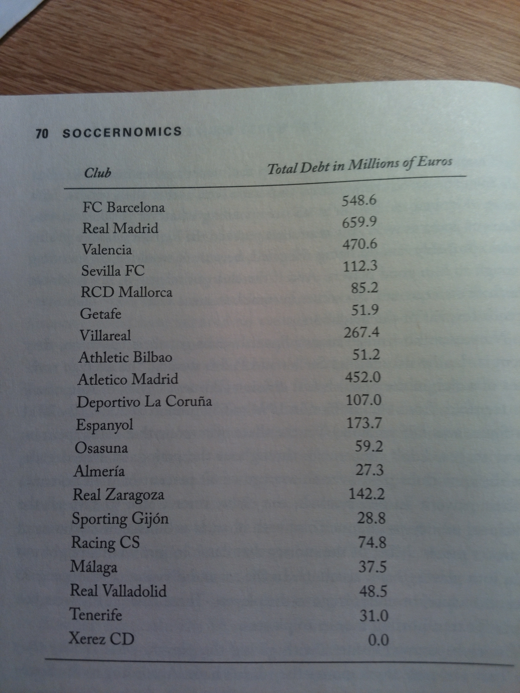
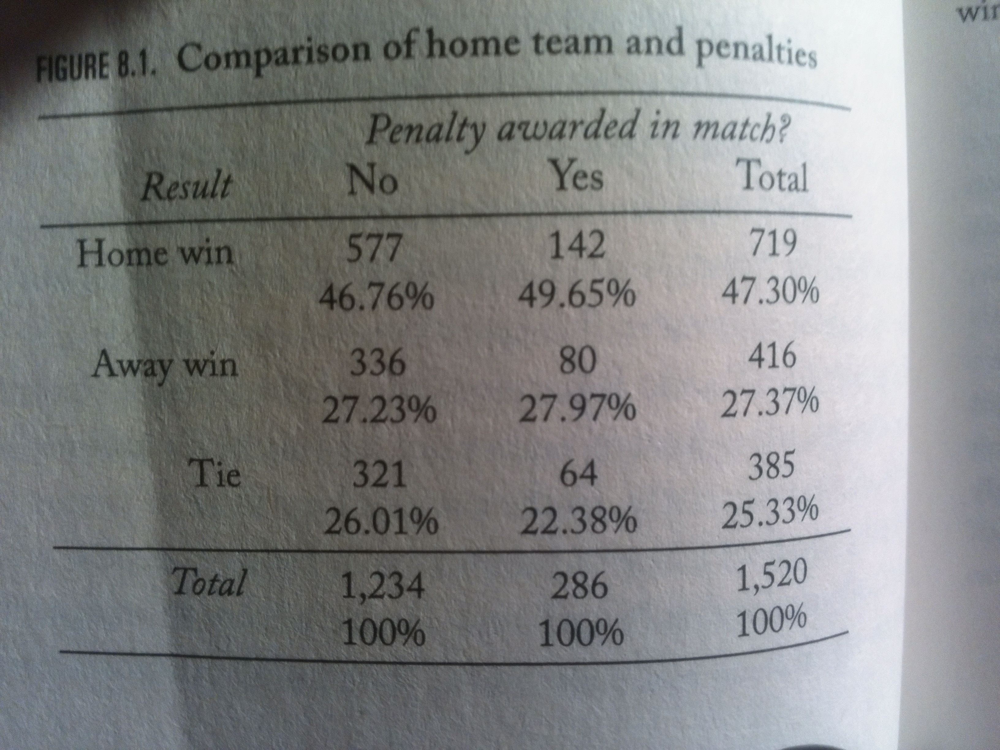
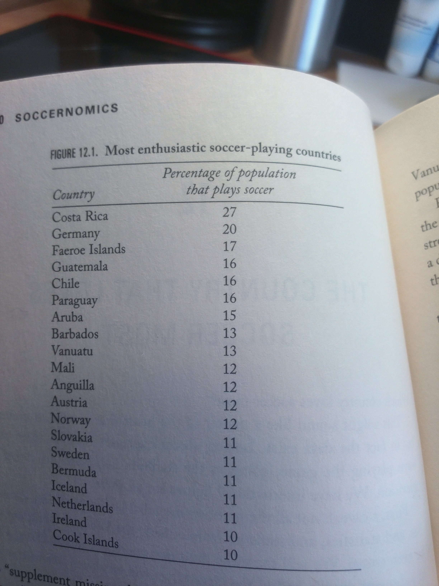
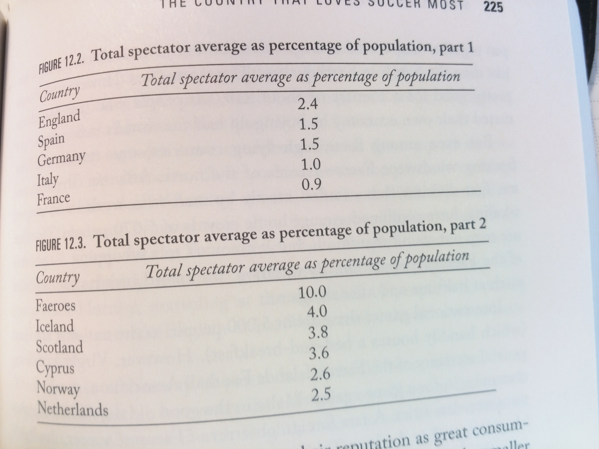
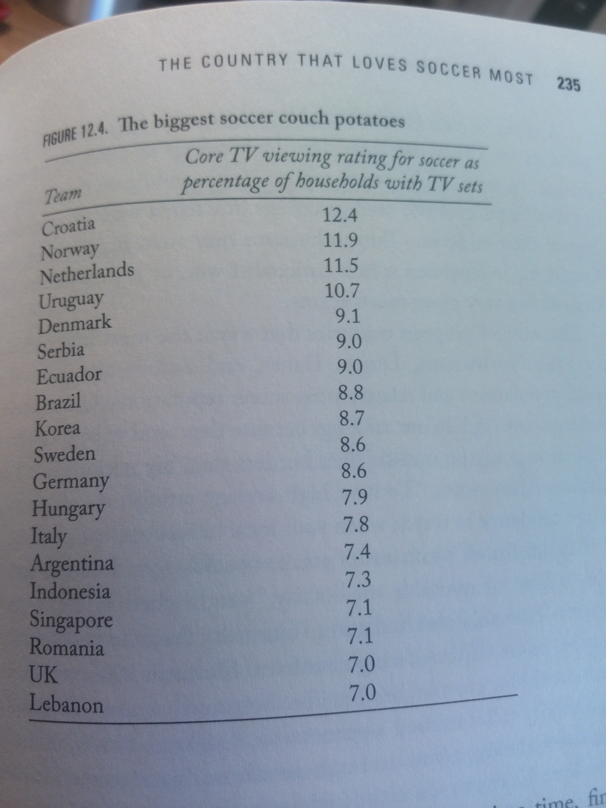
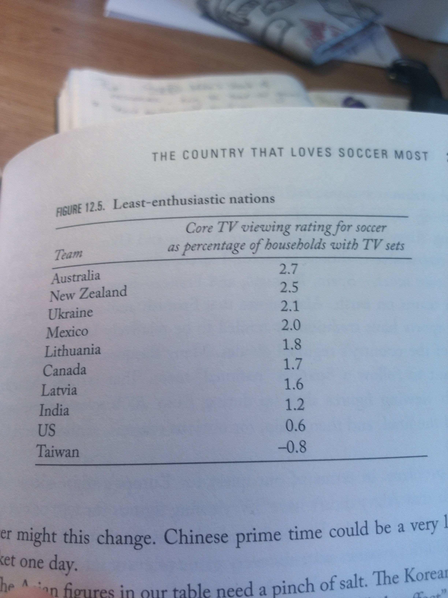
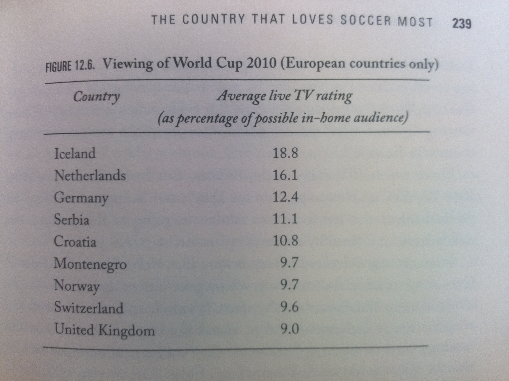

### 1. Driving with a dashboard: In search of new truths about soccer

- Soccer is turning into the numbers game, statistics are much more involved. This comes from the baseball principle (Moneyball - book/film)

## Part 1 - The Club

###  2. Gentlemen prefer blonds: How to avoid silly mistakes in the Transfer Market **

- It’s not the price of the players that bring clubs in higher position, it’s their wages.

** **

- A new manager always wastes money, it’s almost always inefficient ones/ use the knowledge of the crowds
- Stars of the recent World Cups, or European Championships are overvalued
- Certain nationalities are overvalued (i.e. Brazilians)
- It is noticed that scout staff monitor (notice) blondes, because they are easier to spot
- Helping players relocate is extremely important. Statistics show that the players who got helped perform better.
- Best time to buy a player is in his 20’s

### 3. The Worst  Business in the World: Why Soccer Clubs Don't (and Shouldn’t) Make Money**

- Even when clubs make money, it is crucial to invest it back in. Soccer should’t be a business. There is no possible way it will be even remotly as big as say Walmart.

**
**

### 4. Safer then the bank of England: Why Soccer Clubs Almost Never Disappear.**

- For the rich clubs: those are so big, that if they disappear companies might go bankrupt too, people will turn away from firms that "ruined" their club.** **So companies let big clubs’ debt go.
- For poor clubs: that’s peoples’ way of resting, getting away from problems. So, in the example of FC Aldershot, fans didn’t let the club go. What they did, is they collected money payed the debt and liquidated the club, so that anyone can buy shares and "donate"/invest money.

**    ! 5. In praise of Sugar Daddies: Why "Financial Fair Play" is bad for soccer !**

- FFP wants all clubs to solve (pay it debts with their profits)

This rule affects poor clubs. This is because loaning companies are ready to drop some of the credit for rich clubs (since it is a brand), but not for poor clubs, so they are the ones who get hit. Btw, this rule only applies to clubs who qualify for European competitions.

- Second rule is that averaged over 3 years, club’s "relevant income" must match "relevant expenses"

This will also hurt poor clubs, since rich clubs can get money from their owners. If this happens, any competition will go.

     Even if this works and clubs will become profitable, that kills football, as we discussed earlier.

**     6. Need not Apply: Does English Soccer Discriminate Against Black People?**

- Black players weren’t popular, until they first appeared in football. After this happened managers noticed the outstanding physical skills, it quickly became popular.

**     7. Do coaches matter? The Cult of the White Manager**

**     8. The Economist’s Fear of the Penalty Kick: Are Penalties Socmically Unfair, or Only If You Are Nicolas Anelka?**

- Almost all clubs now record players’ penalty shoots, to predict what they next shot will be. Almost always this data is reliable, just like in Chelsea - Manchester United (Champions League final match). Van der Sar got into Anelka’s mind, cause he started to notice the pattern which Chelsea’s statisticians picked up. Van der Sar jumps left.

**     9. The Secret of Claude Makelele: How "Match Data" are changing the game on the field**

- This chapter talks about deep statistics oа players and how do they affect managers decisions on what players to buy, what players to put in the starting squad. So, statistics helps managers to see insight on players’ game, which might be shown on the "outside".

**     10. The Suburban Newsagents: City Sizes and Soccer Prizes**

- Industrial cities and cities with small population tend to have the best clubs. There are various reasons for that. The main one though is that those small cities aren’t famous and that would be one of the way to make your city popular, to be more known.

**     11. Football vs. Football**

- This chapter talk about whether soccer or football is the right name for the game. And again *statistics* show that the word soccer came from England itself. That in the past they used to call the game soccer as much as they did call it football. So, it is not something that Americans came up with.

***Part 2 - The Fans***
**     12. The Country that loves soccer most**

- **What country players the most?**

**    **

- **Who comes to the stadium?**

**
**

- **Who watches the most TV soccer?**

**
**
**
**
**
**
**   **  

- Our winner is Iceland. They love football the most!

**
**

**     13. Are Soccer Fans Polygamists? A critique of the Nick Hornby Model of Fandom**

**     14. A Fan’s Suicide Notes: Do People Jump off Buildings when their teams lose?**

**     15. Happiness: Why Hosting a World Cup is good for you**
***Part 3 - Countries***
**     16. Why England Loses and others win**
**     17. The curse of poverty: Why poor countries are poor at sports**
**     18. Tom Thumb: The best Little soccer country on Earth**

**     19. Made in Amsterdam: The Rise of Spain and the Triumph of European Knowledge Networks**

**     20. Core to Periphery: The future map of Global Soccer**
**     21. Afterword: The best of times
**
    