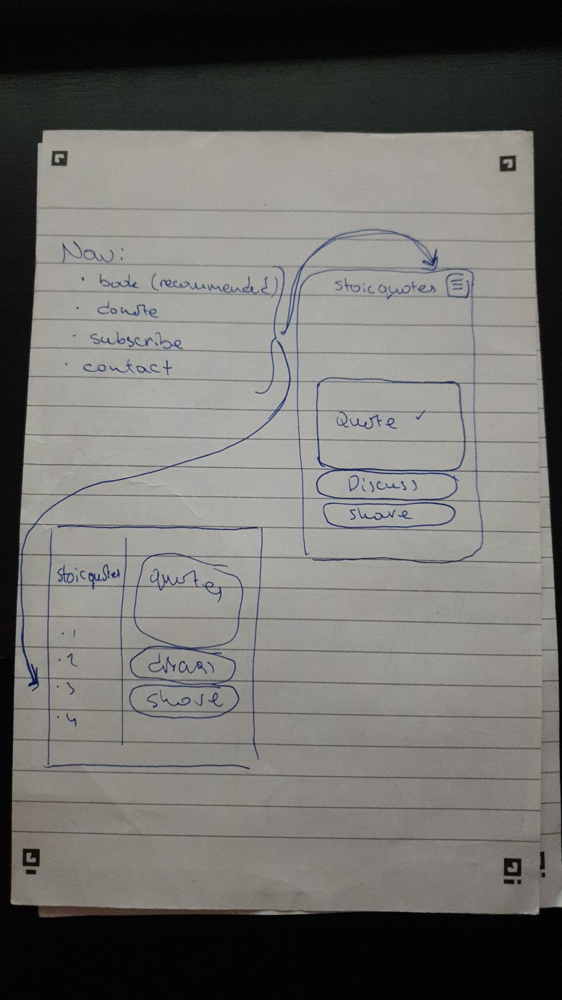
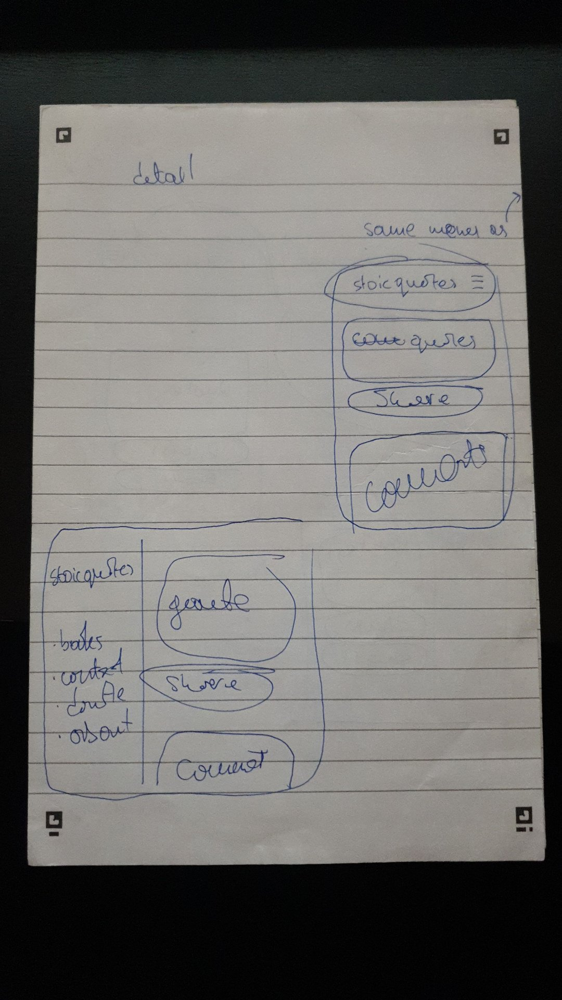
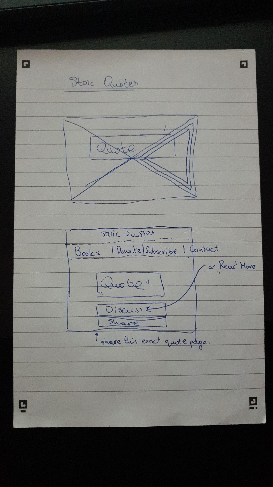

* Allow people to add quotes via django form
    * They would have to provide their name and email

* Model will include:
    Quote, author, link, theme, uploaded_timestamp

Check out stoicmaxims.github.io

* Paid slack channel for interested people 
* MVP - just a page that spots out random quote  
* When user submits quote it is in the test category. 
  * If more than 10 likes, it is moved to main category and dispalyed on the main page.v
* Data can be used to analuse wording of stoic style quotes 

    