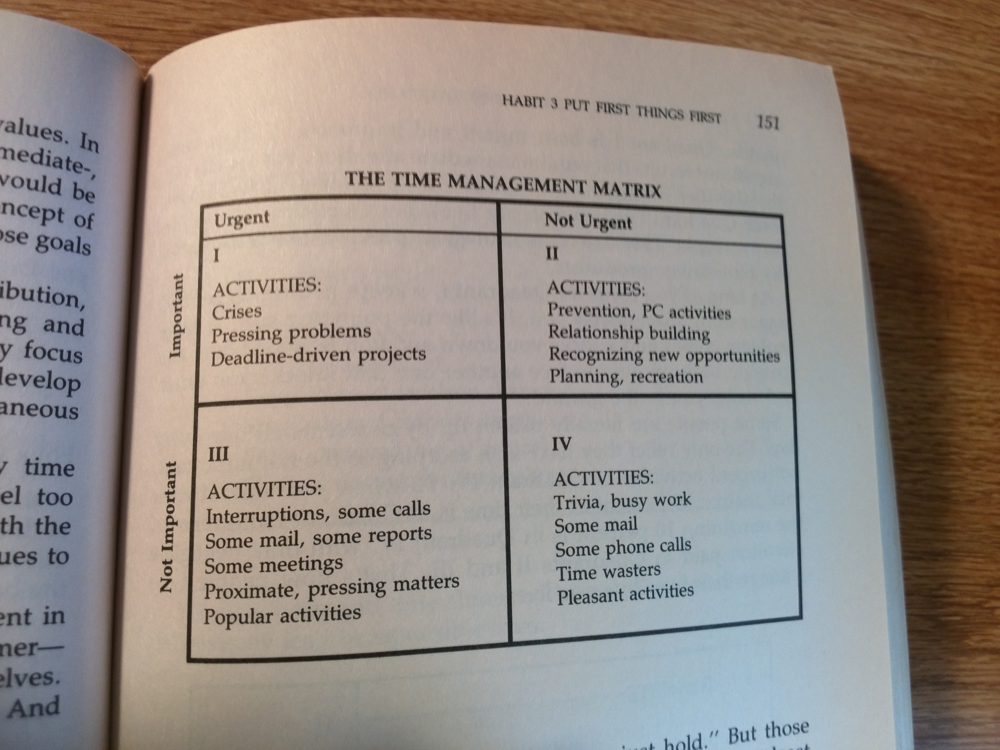
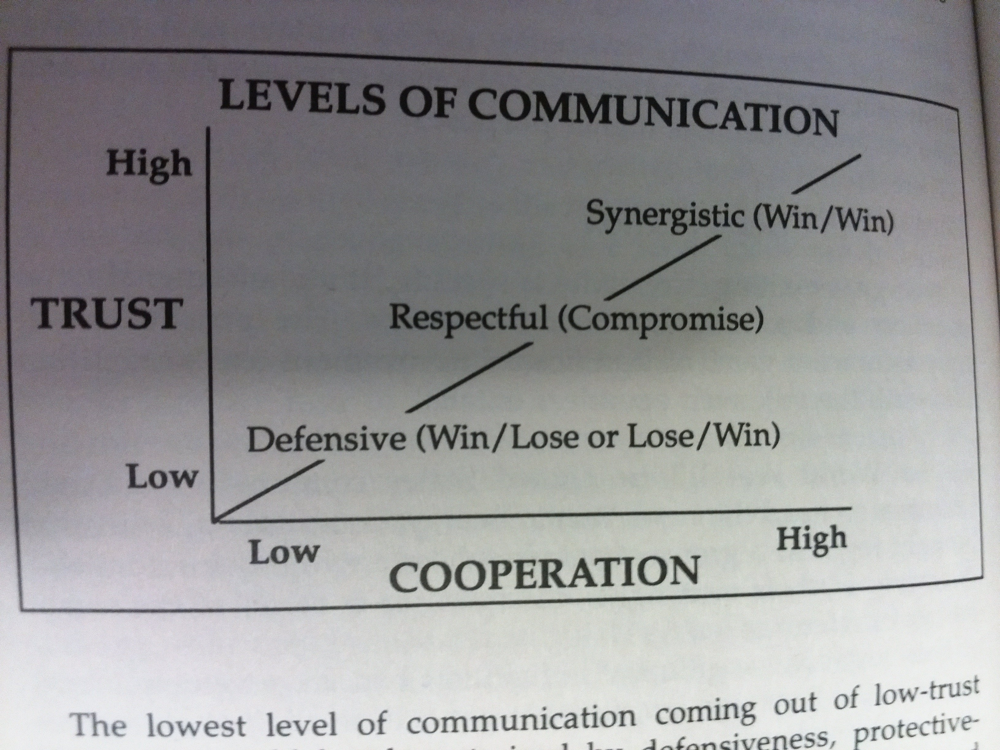
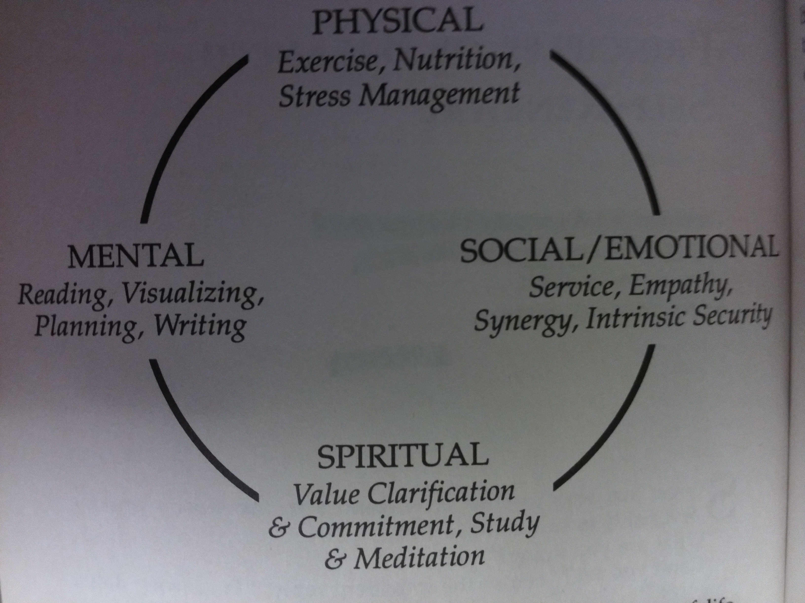

**Independence**

**1. Be Proactive (Principles of Personal Vision)**

- Proactivity means more than merely taking initiative.
- Being initiative means to recognize our responsibility to make things happen.
- Don’t be concerned with stupid things. Forget about it. Focus on influence you can make and things make on you.

**2. Begin with the End in Mind (Principles of Personal Leadership)**

- It is important to always begin your day with the image, picture,or a paradigm of the end of your life as your frame oа reference or the criterion by which everything else is examined.

- Personal leadership is the ongoing process of keeping your vision and values before you and aligning your life to be congruent with those most important things.

**3. Put First Things First (Principles of Personal Management)**

- 4 Human endowments - Self-Awareness, Imagination, Conscience and *Independent Will*
- Independent Will is the ability to make decisions and choice and act in accordance with them.

- Habit 1 tells you "You’re the programmer", Habit 2 "Write the program", Habit 3 "Run the program" or "Live the program".

**- Paradigm of interdependence.**

- Effective interdependence can only be built on a foundation of true independence.

The six "deposits" to interdependence
1. Understanding the Individual
2. Attending the Little Things
3. Keeping Commitments
4. Clarifying Expectations
5. Showing Personal Integrity
6. Apologizing Sincerely When You Make a Withdrawal

**Interdependence**

**4. Think Win/Win (Principles of Interpersonal Leadership)**
** - Five dimensions of Win/Win**

**- Character (needs):**

- Integrity
- Maurity
- Abundance Mentality
- **Relationships:**

**- Agreements:**
**- Systems**
**- Processes**

**5. Seek First to Understand, Then to Be Understood (Principles of Empathic Communication)**

- Seek first to understand principle urges you to listen for the sake of listening/ understanding, not for the sake of replying

**6. Synergies (Principles of Creative Cooperation)**

**7. Sharpen the Saw (Principles of Balanced Self-Renewal)**

- 4 Dimensions of Renewal

    