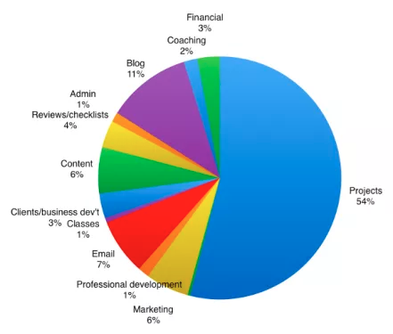

[One-Touch to Inbox Zero: How I Spend 17 Minutes Per Day on Email](https://fortelabs.co/blog/one-touch-to-inbox-zero)

---

I spend 17 minutes per day on email, or 7.43% of my total work time over the past 12 months.
The average information worker, in contrast, spends 28% of their time reading, writing, and responding to email — nearly 4 times as much.

---

The key to Inbox Zero, everyone knows, is to “touch each email only once.”
But what most do not appreciate is that this level of simplicity is the ultimate sophistication — only a well-designed underlying system can make such elegant action possible.

---

Let’s turn back the tide and strip email down to its original function, the only one that it does better than any other tool: collecting new inputs.

> Email's original function

---

**Turn off multiple inboxes**

When you’re able to One-Touch emails at a rate of one every few seconds, having multiple inboxes only multiplies the effort. It’s weird — once your email workflow gains economies of scale, you actually benefit from greater volume.

Settings > Inbox tab > set Inbox type: to Default > uncheck all Categories: except for Primary
twitterLink: ""
hnLink: ""
redditLink: ""
indiehackersLink: ""

---

**Turn off all notifications**
Your email inbox is someone else’s To Do list.

> This is crucial. I followed Tim Ferriss advice a few years back on stripping down notification on my phone. If I haven't done that, I think I would be less far in my life journey than I am now.

---

Every conceivable email you receive can be handled by just 4 downstream systems:
* a digital calendar (G Calendar)
* a task manager (Todoist)
		There are a lot of benefits to using a digital task manager, but for One-Touch purposes, there is one single most important feature: the program’s ability to capture and link back to email-based tasks.

* a reference app (Joplin)
* a read later app. (Pocket)

> So it is importnant those apps function well.

---

That is our real goal — lowering our reactivity is an end in itself, because anything that forces you to react controls you.
