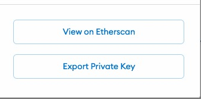

In this tutorial, we will create an Ethereum token on the Polygon Network from scratch. To create our token we will use Python and Python-like programming languages ([Brownie](https://eth-brownie.readthedocs.io/en/stable/toctree.html) and [Vyper](https://vyper.readthedocs.io/en/latest/), we will learn more about them later).

By the end of this tutorial, you will have a personal token on a real Polygon network and hopefully a better understanding of how everything works on the Ethereum network.

One thing to keep in mind is that the Python library we will be using today is meant for development and testing only. This means that the code we will write today is not meant to be used for production and users should not be interacting with it. However, that doesn't mean your token isn't "real". It is very real and can be used as any other token. Mainly you can just transfer it to someone else. At this stage, there isn't a ton of utility behind it, since it will be created in isolation.

I have decided to call my token razzle-dazzle for unimportant reasons. Even though it doesn't matter too much, but I encourage you to come up with a fun, short name that will be somewhat personal to you.

If at any point you are lost or having trouble following, you can also use my [Github repo](https://github.com/rasulkireev/razzle-dazzle) where I host this code. If you have any questions, feel free to create an issue in that repo.

## 1. Prerequisites

In this tutorial, we are going to use a lot of cool Python-related libraries, so it would be great if you had some experience with Python. Even if you didn't you should be fine, but if you run into any issue, it will be harder for you to debug. Furthermore, if you didn't have any Python experience, it would make more sense for you to learn Ethereum related development with Javascript, as it is more popular, offers more tutorials and support. This tutorial is done for people who love developing with Python and would love to learn more about the crypto development space with the language that they already know and love.

> Python is in my ♥️

Now that we have the basic knowledge out of the way let's talk about technical things. I will be developing on a macOS with the following technologies:
### a. Poetry
[Poetry](https://python-poetry.org/docs/) is the new, hot tool that helps with dependency management and deployment. It is awesome. If you haven't worked with it before then you are in for a treat. You can install poetry by running this script in your terminal
```
curl -sSL https://raw.githubusercontent.com/python-poetry/poetry/master/get-poetry.py | python -
```

### b. Pyenv
[Pyenv](https://github.com/pyenv/pyenv). Pyenv helps us to manage multiple versions of Python on our machine. It is a great tool that will make your life easier as you develop different Python projects. I recommend installing pyenv via Homebrew. If you have Homebrew installed just run `brew install pyenv` in your terminal.
> If you don't have Homebrew, use [this tutorial](https://setapp.com/how-to/install-homebrew-on-mac) to get it working.

### c. Pipx
[Pipx](https://pypa.github.io/pipx/). Pipx is a tool that allows us to install python libraries on your local machine without worrying about virtual environments and version mismatches. Pipx can also be installed with Homebrew. Just run `brew install pipx` in your terminal.

### d. Brownie
[Brownie](https://eth-brownie.readthedocs.io/en/stable/toctree.html). Brownie is a Python-based framework that will make it a lot easier for us to develop and test smart contracts on the Ethereum network. Brownie will need to be installed via pipx. So, make sure you install that first. Once you are ready, run `pipx install eth-brownie` in your terminal.


Alright! If all went well, you can pat yourself on the back. Take a breath or two and start reading the next part of the tutorial. This is where all the meat is.

## 2. Setting up your Project

### a. Creating Project Folder

The first thing that comes in handy is the brownie installation. Brownie has a lot of cool templates that we can use to quickstart our development. To see the list of templates (mixes), look in [their repo](https://github.com/brownie-mix/). We are going to use the [vyper-token-mix](https://github.com/brownie-mix/vyper-token-mix) since we are going to "write" our smart contracts in Vyper (a Python-like language to write smart contracts. Solidity competitor).

So, to use the template we are first going to the folder where you host all your code. I like to keep my project under the `code` folder. This makes it very neat. If you have a folder of your preference, "go there" in your terminal via `cd {folder of your choice}`. If you don't have a centralized location for all your code, do this:

1. Run `mkdir ~/code` in your terminal. This will create a `code` folder inside your home directory.
2. cd into that new folder via the `cd ~/code` command in your terminal

Now in that folder run the following command `brownie bake vyper-token`. This will scaffold a project folder for you that will work in. The created folder will be called `vyper-token`. Feel free to change the name of this folder to the name you have decided to give your project. Mine is called `razzle-dazzle`.

**From now on I'm going to refer to this folder as `razzle-dazzle`. So, whenever you see this name, replace it with your own.**

#### Getting familiar

If you look under the contracts folder there is a file called `Token.vy`. This is the general ERC-20 type smart contract that will lay out the basic token requirements. You don't have to do anything more. The core functionality is already there. In fact, we are not going to do any other Vyper related work in this tutorial. Just more brownie and python.


### b. Setting up Dependencies and Versions

#### Poetry

This is the part where we start using Poetry. First open up your project folder in VS Code or another code editor of your choice (ideally, it should have a terminal built-in). From the terminal of your code editor run `poetry init` to start the poetry project. In reality, running this function will just help you with creating the `pyproject.toml` file where we will keep note of the dependencies we are using.

Once you run `poetry init` you will be asked for some inputs, like the project name, project description, etc. Feel free to use the defaults or to change them up. **The only thing that I want you to be careful with is the python version we are going to use. The default is likely to be `^3.7`, but I want you to change it to `^3.8` and press enter.** If for some reason you can accidentally, pressed enter at the Python version stage, don't worry you can change it later, directly in the `pyproject.toml` file.

When you are asked if you want to set dependencies programmatically, enter `no`. Finally, the script will ask you to confirm the creation of the toml file, to which you should respond `yes`!

> This is where you would manually change `^3.7` to `^3.8` on the python version line.

#### Pyenv

Another really important part is the actual Python version we are going to use in our project. What we did a second ago in the pyproject.toml file is that we said what is the minimum python version we are willing to work with, but now we actually need to set the python version we are going to use. Pyenv will help us with that.

So from the inside of your project directory, run the following command in your terminal `pyenv install 3.9.6`. This will install Python 3.9.6 version on your machine. Once it finishes installing (it might take a minute or two, be patient :) ), run `pyenv local 3.9.6`. This will set the python version inside your project directory. Test this, by running `python -V`, you should be able to see the `3.9.6` response.

If this step was successful, let's move to the next one.

#### Dependencies

**Pytest**. The one annoying thing with brownie is that it is very picky with package versions. For instance, by default poetry adds a pytest version that is incompatible with brownie. To fix that we are going to run `poetry add -D pytest@latest` in your terminal. This will install the latest pytest version. Once this command finishes running you should be able to see the change that happened in your `pyproject.toml` file.

**Brownie**. Next, let's add brownie as a dependency in our project. You can do this by running `poetry add eth-brownie` in your terminal. This should run nicely.

**Vyper**. Next, let's add vyper as a dependency. As you can guess, you can do that with a `poetry add vyper` command. Here, there might be a catch with versions. If not you are lucky, otherwise here is what it might look like. By far the most common issue you can get at this point is that if poetry throws an error that will sound something like this:

> `eth-brownie` depends on `vyper {version something, something}`

If you see this then all you need to do is to run `poetry add vyper@^{required version}` instead of just vyper. That tells poetry to add a specific version of vyper to your project that `eth-brownie` package likes.

#### Testing the environment

Now that we did all the groundwork, let's test if all the installations are working nicely with each other. Try running `poetry run brownie console` in your terminal. If the console doesn't throw any error at you and you can actually see something that looks like a Python interpreter, then good job, we can move to the next steps! If you are running into some issue make sure to DM me on [Twitter](https://twitter.com/rasulkireev), I'll help you debug your issues.

> The reason we are running commands with `poetry run` before them is that this way we are telling our console to run using poetry. This way poetry will create a virtual environment for us and we don't have to think about these things anymore.

Try playing around with the console. Type `accounts` and press `Enter`. This should display the 10 wallet addresses that brownie created for us in the test network. To see other things you can do in brownie console, check out [their docs](https://eth-brownie.readthedocs.io/en/stable/toctree.html) (they are excellent).

### c. Setting up the Wallet and Network Connection

To create a token on one of the Ethereum networks we will have to connect to those networks. For that we will need two things:
- a wallet (like [metamask](https://metamask.io))
- an [infura account](https://infura.io)

A wallet will hold your token and will be used to make any transactions. An Infura account is required to actually connect to the Ethereum network. You could try doing it yourself, for that you would need to get the whole Ethereum ledger among other things. This is a hassle, so I recommend going with Infura, they make it very easy, and free, especially if you are just playing around with it. They only start charging after more than 100k operations have been made with your Id.

#### Infura

1. Go to the [Infura's website](https://infura.io) and create an account there.
2. Once registered go to the Ethereum tab and "Create a New Project".

   
   

3. Then go to the setting tab under your project and see if a "client id" and a "project secret" have been generated. If so, then we are all good on the Infura front.

   

4. One last config you have to do is to enable the Polygon Network on your Infura account. To do that, head over to the [payments page](https://infura.io/payment), click on the Polygon PoS option, and `Update Subscription`.

   


#### Wallet

For the wallet requirement, we are going to use [Metamask](https://metamask.io).

1. Go to the link above and install the browser extension.
2. Follow the steps to create your first wallet.
   1. If you already have a wallet, I suggest you create a new one, just for testing this tutorial. That way we minimize any chance of leaking secret info. Although this tutorial has this covered.
3. Then you need to add Polygon mainnet and testnet to your metamask wallet. To do that please follow [this tutorial](https://www.publish0x.com/the-glitcher/how-do-i-connect-polygon-matic-to-metamask-xxyyqpw).
4. One last final thing. You need to have some MATIC in your wallet, both on the Mainnet and the Testnet. You can get MATIC for Testnet [here](https://faucet.polygon.technology) and Mainnet [here](http://macncheese.finance/matic-polygon-mainnet-faucet.php). If either option is not working try the [following link](https://blog.pods.finance/guide-connecting-mumbai-testnet-to-your-metamask-87978071aca8).

#### Environment Variable

It is never a good idea to keep your secrets directly in the code. Instead, we need to use the environment variable. Here is how to do it well.

1. create a `.env` file.
2. In that file add the following:

   ```
   WEB3_INFURA_PROJECT_ID='asdfasdfasdfasdf'
   PRIVATE_KEY='0x123489jdfghsdfhdfghdfhh'
   ```

   Where the `WEB3_INFURA_PROJECT_ID` is the Infura Project ID that you saw when you created the Infura Project. Copy that over to the `.env` file. The PRIVATE_KEY is your wallet private key. To get it, you should click on your Metamask extension and press the three dots on the top right corner.

   

   Once you clicked the Account Details button, the next button to click will be the Export Private Key.

   

   Copy the key over to the `.env` file.

3. Finally, the final step to making this super secure is to make sure git doesn't track and therefore doesn't expose that file. In order to do that, create a file called `.gitignore` and add `.env` to it. Make sure to have only one file/folder per line. This is what I have in my .gitignore file:

   ```
   __pycache__
   .history
   .hypothesis/
   build/
   reports/
   .env
   ```

4. Once you add those secrets, we need to make sure our code can read them. For that add a new dependency to our project by running `poetry add python-dotenv` in your terminal.
   > Note: if you ever run into an issue with dependency versioning like below try installing the exact version that is "requested". This is because `eth-brownie` is somewhat strict on versions it uses for some packages. So in this example, I would do `poetry add python-dotenv@0.16.0`

   

5. Finally, we need to tell Brownie where to look when it comes to Env Vars. We can do that by modifying the `brownie-config.yaml` file. We don't yet have that in our repo. So, go ahead and create that file in the root folder of your project. Then add the following line to it:
  ```
  dotenv: .env
  ```

  That's it.


## 3. Deploying your Token

Now that we are done with the set up we can get to the actual Token creation.

### a. Creating a Local Account

When we first played around with the Brownie console you saw that 10 accounts were created. None of these were "our" accounts. Since a minted token will need to be created from an account we need to create one.

So, to create an [account](https://eth-brownie.readthedocs.io/en/stable/account-management.html#local-accounts) on our local machine you are going to run this command:

```
poetry run brownie accounts new test-account
```

> Note that you can use any name that you want instead of `test-account`. You can give it the name of your token like I did `razzle-dazzle-account`.

You will be asked for your Private Key and Your Password. For the Private Key you can use the value that you saved in the `.env` file. For the Password you can use your Metamask password.

> Note: You can actually use other values for that command, something that you come up with. But to keep it simple, I thought it makes sense to use the same values.

Once you give those, you should see a message like this:

```
SUCCESS: A new account '0x84E080ABF7657948ACa5eEF631069b3d8f7a7asdasdasd' has been generated with the id 'test-account'.
```

### b. Preparing the deployment file

In the `scripts` folder create a `token.py` file. Then add the following to that file:

```python
#!/usr/bin/python3
import os

from brownie import Token, accounts

def main():
    account = accounts.load('test-account') # If you gave your account a different name, use that instead.
    return Token.deploy("Razzle Dazzle", "RD", 18, 1e20, {"from": account})
```

Let's quickly go over what is happening on the last line.

1. "Razzle Dazzle" is the name you want to give your Token. You can enter anything you want here.
2. "RD" is the short ticker symbol. You can enter anything you want here.
3. 18 is the number of decimals your token will have. This is mostly a standard, so I suggest you keep this value.
4. 1e20 is the number of tokens you will receive. This is the same as 1000. You can enter any amount you want.

We should be ready to deploy our token!!!.

### c. Deploying our Token

Well, we are almost done. First, we will deploy to the test network. To do that use the following command (in your terminal):

```
poetry run brownie run token.py --network polygon-test
```

You will be asked to enter the password. Use the password you used in the account creation stage. If everything goes well, you should see something like this:

```
Brownie v1.16.2 - Python development framework for Ethereum

RazzleDazzleProject is the active project.

Running 'scripts/token.py::main'...
Enter password for "hello":
Transaction sent: 0x0512b92fa73b127db55b7c9db7bd15db69d2ee2f1275f24a7f9ee03391b5d568
  Gas price: 3.0 gwei   Gas limit: 527562   Nonce: 2
  Token.constructor confirmed   Block: 20278304   Gas used: 479602 (90.91%)
  Token deployed at: 0xE7A5707dC35FFFfb90e0D100500830dba066A5dC
```

If that happened, congrats, you did it. We can move on to the mainnet network. If it didn't work, you need to look at the error output, it will suggest what you need to do.

Let's deploy to the mainnet now (to make it more "real"). All you have to do is replace the network flag, like so:

```
poetry run brownie run token.py --network polygon-main
```

You will have to repeat the same process as before.

### d. Seeing you Tokens in your wallet

The last thing to check if everything worked is to check if the tokens are in your wallet. To do that we can head over to the Metamask extension and import the token.

1. Copy the location where the token was deployed to. It is the last value you get in the output, after running the `token.py` pipeline.
2. In the Metamask extension, go to the `Assets` tab and press the `Import Token` button.
3. Enter Contract Address (for me it is `0xE7A5707dC35FFFfb90e0D100500830dba066A5dC`), Token Symbol (for me it is `RD`) and the Token Decimal (18).
4. Press `Add Custom Token`

You should now see the token in your wallet and can do anything you want.

## 4. Final Words

Congrats on completing this lengthy tutorial. I hope everything was clear and understandable. Also, I hope it went smoothly, without any issues. If any issues occurred I hope you contacted me for help.

As mentioned in the beginning, this token is a real deal and you can do all the regular things you would do to other tokens, like sending them to other people. However, there isn't much use to your token, in other words, it doesn't have much utility.

But don't get disappointed. The whole point of this tutorial was to show you how easy it is to develop and test your Crypto ideas using python and brownie. If you spend some time learning vyper or solidity to develop smart contracts, you will be able to easily test your ideas with the eth-brownie library.

Thanks for taking the time to read this tutorial. Hope you have a great day and a great crypto learning journey.